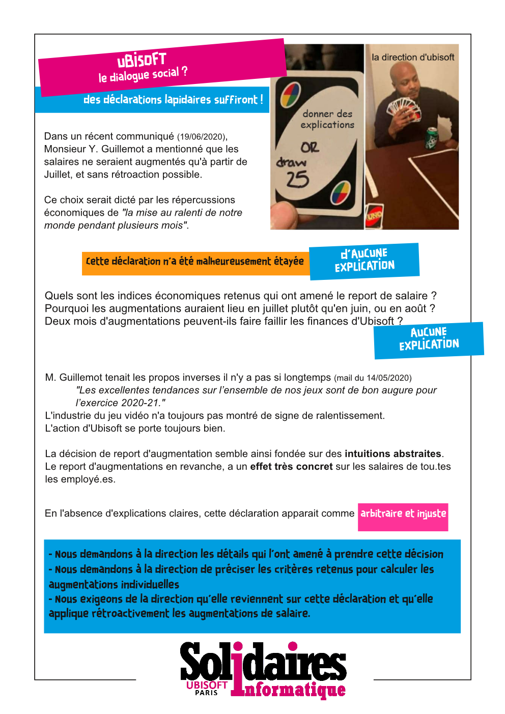

Dans un communiqué du 19/06/2020, Monsieur Y. Guillemot a mentionné que les salaires ne seraient augmentés qu'à partir de Juillet, et sans rétroaction possible. Ce choix serait dicté par les répercussions économiques de *"la mise au ralenti de notre monde pendant plusieurs mois"*.
Cette déclaration n'a été malheureusement étayée d'aucune explications.
- Quels sont les indices économiques retenus qui ont amené le report de salaire ? 
- Pourquoi les augmentations auraient lieu en juillet plutôt qu'en juin, ou en août ?
- Deux mois d'augmentations peuvent-ils faire faillir les finances d'Ubisoft ?

Il y a un mois, M. Guillemot tenait les propos inverses (mail du 14/05/2020) *"Les excellentes tendances sur l’ensemble de nos jeux sont de bon augure pour l’exercice 2020-21."* 
L'industrie du jeu vidéo n'a toujours pas montré de signe de ralentissement. 
L'action Ubisoft se porte toujours bien.

La décision de report d'augmentation semble fondée sur des intuitions abstraites.
Le report d'augmentations en revanche, a un effet très concret sur les salaires de tou.tes les employé.es.

En l'absence d'explications claires, cette déclaration apparait comme **arbitraire et injuste**.
- Nous demandons à la direction les détails qui l'ont amené à prendre cette décision
- Nous demandons à la direction de préciser les critères retenus pour calculer les augmentations individuelles
- Nous exigeons de la direction qu'elle reviennent sur cette déclaration et qu'elle applique rétroactivement les augmentations de salaire.

