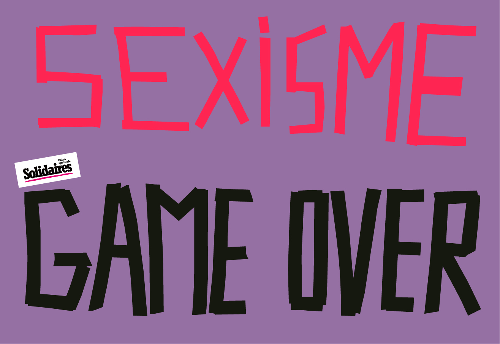

Une marée d'accusations s'est levée contre les prédateurs, harceleurs et agresseurs sexuels et sexistes présents dans le jeu vidéo.  
Sans surprise, ces accusations touchent de nombreux.ses employé.es d'Ubisoft.  
Sans surprise, ces accusations touchent de nombreux studios d'Ubisoft.  
Sans surprise, ces accusations touchent tous les échelons hiérarchiques d'Ubisoft, du plus bas au plus élevés.

Il ne s'agit pas seulement de quelques cas isolés, dont l'exclusion seule suffirait à résoudre le problème, mais d'une question systémique, qui semble tolérée de manière massive et de longue date.  

Nous demandons qu'Ubisoft prenne ses responsabilités et entreprenne des changements en profondeur, en identifiant toutes les personnes, les mécanismes et la culture qui a permis et protégé ses violences et en la changeant radicalement, plutôt que quelques licenciements, de la communication externe et du *damage control*.  
C'est un minimum, qui ne saura réparer les innombrables talents féminins que l'entreprise aura étouffé sous ces violences, mais qui, nous l'espérons, aidera à briser, au moins à Ubisoft, ce cercle vicieux qui a cours dans toute l'industrie.  

La section syndicale Solidaires Informatique Ubisoft Paris loue le courage de celles qui se sont exposées pour prendre la parole. Nous exprimons notre entier soutien à l'ensemble des victimes, et réaffirmons à nouveau notre capacité syndicale à l'accompagnement dans des démarches judiciaires.

Ci-dessous, la [déclaration officielle de notre syndicat Solidaires Informatique](https://solidairesinformatique.org/2020/06/26/contre-les-violences-sexuelles-et-sexistes-la-peur-doit-changer-de-camp/).

---

A l’heure où de nombreuses victimes brisent le silence sur le harcèlement et les agressions dans l’industrie du jeu vidéo, nous saluons leur immense courage de se dresser non seulement contre ces harceleurs, mais aussi contre le système qui les protège ceux-ci depuis des années ; nous leur adressons tout notre soutien, et nous réaffirmons notre détermination à lutter contre toutes les formes de violences masculines faites aux femmes.

Cette nouvelle vague d’accusations nous l’a encore démontré, dans cette industrie historiquement sexiste les comportements n’ont guère évolué, l’entre-soi et la complicité masculine restent la norme.

Dans les situations de violences sexuelles sur le lieu de travail, les victimes gardent majoritairement le silence comme le démontre l’étude du Défenseur des droits. Notre rôle est d’assister la défense de ces femmes.

Solidaires Informatique est organisé syndicalement pour lutter contre toutes les formes violences sexuelles et sexistes. Ni les menaces ni la justice patriarcale ne nous feront reculer ; nous assumons ces engagements jusqu’au bout et nous ferons peser tout le poids de notre syndicat dans cette lutte.

Nous appelons toutes les victimes à nous contacter et à nous rejoindre, pour briser le silence et lancer l’offensive contre les auteurs de ces violences. Nous sommes déterminé.es à vous accompagner juridiquement face à ces situations.

Solidaires Informatique continuera d’apporter tout son soutien aux victimes de violences sexuelles et sexistes et sera toujours à leur côté pour les défendre.

contact@solidairesinformatique.org

---

As numerous victims break the silence on sexual harassment and sexual agressions inside the video game industry, we salute their immense courage to oppose not only those harassers, but also the system that has been protecting them for years ; we give them our full support, and we assert, once again, our determination to fight against every form of violence against women.

This new wave of accusations prove us once again that, in this historically sexist industry, sexism and male complicity still are the norm.

In situations of sexual violence in the workplace, the majority of victims remain silent, as the study by the French Defender of Rights shows. Our duty is to help women defend themselves.

Solidaires Informatique is organised as a union to fight against every form of sexist and sexual violence. Neither threats nor patriarchal justice will make us back down; we will keep to our commitments against sexual and gender-based violence and we will fully weight on this fight.

We call on all the victims to contact us and join us, to break the silence and launch the offensive against the perpetrators of this violence. We will be with you and help you in any way to help justice be done.

Solidaires Informatique will continue to give its full support to victims of sexual and gender-based violence and will always be by their side to defend them.

