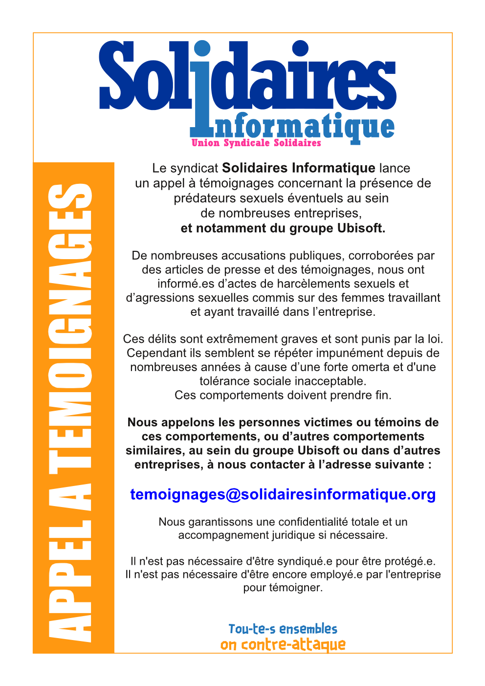

Le syndicat Solidaires Informatique lance un appel à témoignages concernant la présence de prédateurs sexuels éventuels au sein de nombreuses entreprises, et notamment du groupe Ubisoft.

De nombreuses accusations publiques, corroborées par des articles de presse et des témoignages, nous ont informé.es d’actes de harcèlements sexuels et d’agressions sexuelles commis sur des femmes travaillant et ayant travaillé dans l’entreprise.

Ces délits sont extrêmement graves et sont punis par la loi. Cependant ils semblent se répéter impunément depuis de nombreuses années à cause d’une forte omerta et d'une tolérance sociale inacceptable. Ces comportements doivent prendre fin.

Nous appelons les personnes victimes ou témoins de ces comportements, ou d’autres comportements similaires, au sein du groupe Ubisoft ou dans d’autres entreprises, à nous contacter à l’adresse suivante : temoignages@solidairesinformatique.org

Nous garantissons une confidentialité totale et un accompagnement juridique si nécessaire.  
Il n'est pas nécessaire d'être syndiqué.e pour être protégé.e.  
Il n'est pas nécessaire d'être encore dans l'entreprise pour témoigner.  

Tou-tes ensembles  
On contre-attaque

