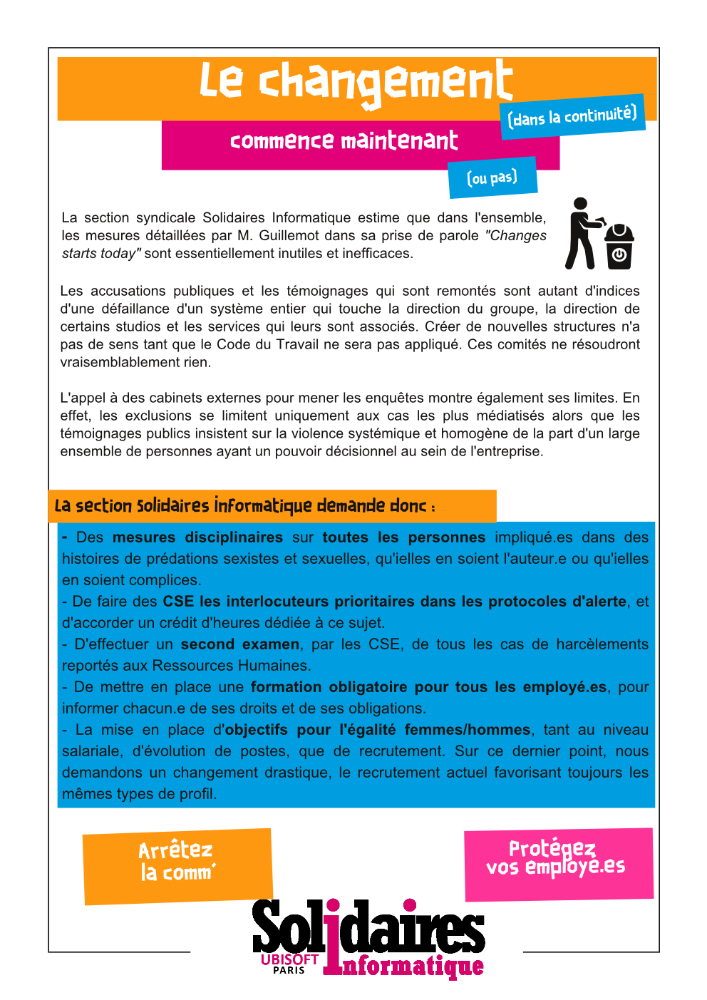

Le changement (dans la continuité) commence maintenant (ou pas)

La section syndicale Solidaires Informatique estime que dans l'ensemble, les mesures détaillées par M. Guillemot dans sa prise de parole "Changes starts today" sont essentiellement inutiles et inefficaces.

Les accusations publiques et les témoignages qui sont remontés sont autant d'indices d'une défaillance d'un système entier qui touche la direction du groupe, la direction de certains studios et les services qui leurs sont associés. Créer de nouvelles structures n'a pas de sens tant que le Code du Travail ne sera pas appliqué. Ces comités ne résoudront vraisemblablement rien.

L'appel à des cabinets externes pour mener les enquêtes montre également ses limites. En effet, les exclusions se limitent uniquement aux cas les plus médiatisés alors que les témoignages publics insistent sur la violence systémique et homogène de la part d'un large ensemble de personnes ayant un pouvoir décisionnel au sein de l'entreprise.

- Des mesures disciplinaires sur toutes les personnes impliqué.es dans des histoires de prédations sexistes et sexuelles, qu'ielles en soient l'auteur.e ou qu'ielles en soient complices.
- De faire des CSE les interlocuteurs prioritaires dans les protocoles d'alerte, et d'accorder un crédit d'heures dédiée à ce sujet.
- D'effectuer un second examen, par les CSE, de tous les cas de harcèlements reportés aux Ressources Humaines.
- De mettre en place une formation obligatoire pour tous les employé.es, pour informer chacun.e de ses droits et de ses obligations.
- La mise en place d'objectifs pour l'égalité femmes/hommes, tant au niveau salariale, d'évolution de postes, que de recrutement. Sur ce dernier point, nous demandons un changement drastique, le recrutement actuel favorisant toujours les mêmes types de profil.

Arrêter  la comm'  
Protégez vos employé.es

