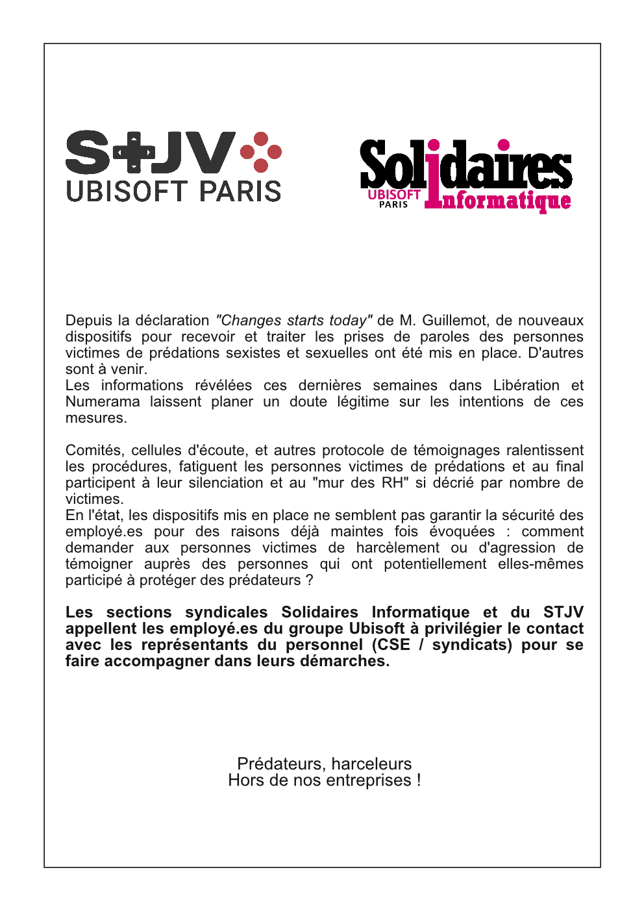

Depuis la déclaration "Changes starts today" de M. Guillemot, de nouveaux dispositifs pour recevoir et traiter les prises de paroles des personnes victimes de prédations sexistes et sexuelles ont été mis en place. D'autres sont à venir.  
Les informations révélées ces dernières semaines dans Libération et Numerama laissent planer un doute légitime sur les intentions de ces mesures.
 
Comités, cellules d'écoute, et autres protocole de témoignages ralentissent les procédures, fatiguent les personnes victimes de prédations et au final participent à leur silenciation et au "mur des RH" si décrié par nombre de victimes.  
En l'état, les dispositifs mis en place ne semblent pas garantir la sécurité des employé.es pour des raisons déjà maintes fois évoquées : comment demander aux personnes victimes de harcèlement ou d'agression de témoigner auprès des personnes qui ont potentiellement elles-mêmes participé à protéger des prédateurs ?

Les sections syndicales Solidaires Informatique et du STJV appellent les employé.es du groupe Ubisoft à privilégier le contact avec les représentants du personnel (CSE / syndicats) pour se faire accompagner dans leurs démarches.
 
Prédateurs, harceleurs  
hors de nos entreprises !

