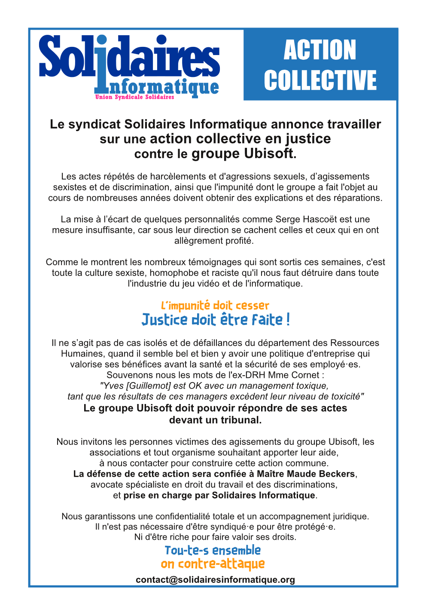

Le syndicat Solidaires Informatique annonce travailler sur une action collective en justice contre le groupe Ubisoft.

Les actes répétés de harcèlements et d'agressions sexuels, d’agissements sexistes et de discrimination, ainsi que l'impunité dont le groupe a fait l'objet au cours de nombreuses années doivent obtenir des explications et des réparations.

La mise à l’écart de quelques personnalités comme Serge Hascoët est une mesure insuffisante, car sous leur direction se cachent celles et ceux qui en ont allègrement profité. 

Comme le montrent les nombreux témoignages qui sont sortis ces semaines, c'est toute la culture sexiste, homophobe et raciste qu'il nous faut détruire dans toute l'industrie du jeu vidéo et de l'informatique.

L'impunité doit cesser  
Justice doit être faite !

Il ne s’agit pas de cas isolés et de défaillances du département des Ressources Humaines, quand il semble bel et bien y avoir une politique d'entreprise qui valorise ses bénéfices avant la santé et la sécurité de ses employé·es.

Souvenons-nous les mots de l'ex-DRH Mme Cornet "Yves [Guillemot] est OK avec un management toxique, tant que les résultats de ces managers excèdent leur niveau de toxicité".

Le groupe Ubisoft doit pouvoir répondre de ses actes devant un tribunal.

Nous invitons les personnes victimes des agissements du groupe Ubisoft, les associations et tout organisme souhaitant apporter leur aide, à nous contacter pour construire cette action commune. La défense de cette action sera confiée à Maître Maude Beckers, avocate spécialiste en droit du travail et des discriminations,  et prise en charge par Solidaires Informatique.

Nous garantissons une confidentialité totale et un accompagnement juridique.  
Il n'est pas nécessaire d'être syndiqué·e pour être protégé·e.  
Ni d'être riche pour faire valoir ses droits.  

Tou·te·s ensemble  
On contre-attaque

