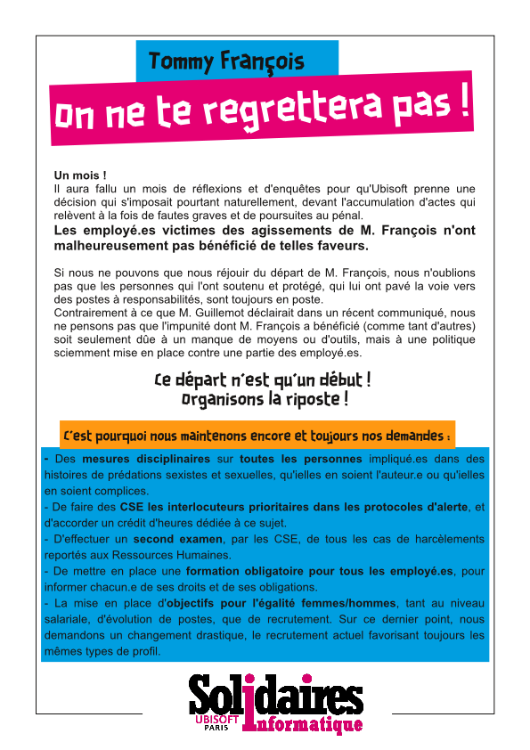

**Un mois !**  
Il aura fallu un mois de réflexions et d'enquêtes pour qu'Ubisoft prenne une décision qui s'imposait pourtant naturellement, devant l'accumulation d'actes qui relèvent à la fois de fautes graves et de poursuites au pénal.  
*Les employé.es victimes des agissements de M. François n'ont malheureusement pas bénéficié de telles faveurs.*

Si nous ne pouvons que nous réjouir du départ de M. François, nous n'oublions pas que les personnes qui l'ont soutenu et protégé, qui lui ont pavé la voie vers des postes à responsabilités, sont toujours en poste.  
Contrairement à ce que M. Guillemot déclairait dans un récent communiqué, nous ne pensons pas que l'impunité dont M. François a bénéficié (comme tant d'autres) soit seulement dûe à un manque de moyens ou d'outils, mais à une politique sciemment mise en place contre une partie des employé.es.

**Ce départ n'est qu'un début !   
Organisons la riposte !**

C'est pourquoi nous maintenons encore et toujours nos demandes :  
- Des mesures disciplinaires sur toutes les personnes impliqué.es dans des histoires de prédations sexistes et sexuelles, qu'ielles en soient l'auteur.e ou qu'ielles en soient complices.  
- De faire des CSE les interlocuteurs prioritaires dans les protocoles d'alerte, et d'accorder un crédit d'heures dédiée à ce sujet.  
- D'effectuer un second examen, par les CSE, de tous les cas de harcèlements reportés aux Ressources Humaines.  
- De mettre en place une formation obligatoire pour tous les employé.es, pour informer chacun.e de ses droits et de ses obligations.  
- La mise en place d'objectifs pour l'égalité femmes/hommes, tant au niveau salariale, d'évolution de postes, que de recrutement. Sur ce dernier point, nous demandons un changement drastique, le recrutement actuel favorisant toujours les mêmes types de profil.  

