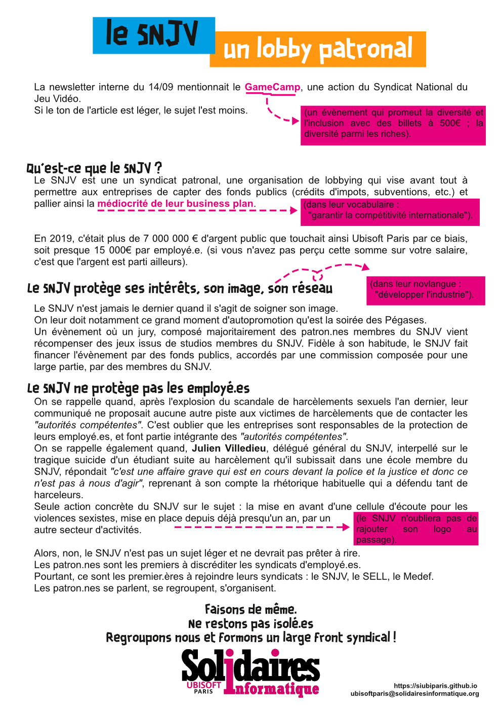

## Le SNJV, Un lobby patronal

La newsletter interne du 14/09 mentionnait le GameCamp *(un évènement qui promeut la diversité et l'inclusion avec des billets à 500€ ; la diversité parmi les riches)*, une action du Syndicat National du Jeu Vidéo.

Si le ton de l'article est léger, le sujet l'est moins.

### Qu'est-ce que le SNJV ?
Le SNJV est une un syndicat patronal, une organisation de lobbying qui vise avant tout à permettre aux entreprises de capter des fonds publics (crédits d'impots, subventions, etc.) et pallier ainsi la médiocrité de leur business plan. *(dans leur vocabulaire : "garantir la compétitivité internationale").*

En 2019, c'était plus de 7 000 000 € d'argent public que touchait ainsi Ubisoft Paris par ce biais, soit presque 15 000€ par employé.e. *(si vous n'avez pas perçu cette somme sur votre salaire, c'est que l'argent est parti ailleurs).*

### Le SNJV protège ses intérêts, son image, son réseau
*(dans leur novlangue : "développer l'industrie").*

Le SNJV n'est jamais le dernier quand il s'agit de soigner son image.

On leur doit notamment ce grand moment d'autopromotion qu'est la soirée des Pégases. 

Un évènement où un jury, composé majoritairement des patron.nes membres du SNJV vient récompenser des jeux issus de studios membres du SNJV. Fidèle à son habitude, le SNJV fait financer l'évènement par des fonds publics, accordés par une commission composée pour une large partie, par des membres du SNJV.

### Le SNJV ne protège pas les employé.es
On se rappelle quand, après l'explosion du scandale de harcèlements sexuels l'an dernier, leur communiqué ne proposait aucune autre piste aux victimes de harcèlements que de contacter les ***"autorités compétentes"***. C'est oublier que les entreprises sont responsables de la protection de leurs employé.es, et font partie intégrante des ***"autorités compétentes"***.

On se rappelle également quand, Julien Villedieu, délégué général du SNJV, interpellé sur le tragique suicide d'un étudiant suite au harcèlement qu'il subissait dans une école membre du SNJV, répondait ***"c'est une affaire grave qui est en cours devant la police et la justice et donc ce n'est pas à nous d'agir"***, reprenant à son compte la rhétorique habituelle qui a défendu tant de harceleurs.

Seule action concrète du SNJV sur le sujet : la mise en avant d'une cellule d'écoute pour les violences sexistes, mise en place depuis déjà presqu'un an, par un autre secteur d'activités *(le SNJV n'oubliera pas de rajouter son logo au passage).*

Alors, non, le SNJV n'est pas un sujet léger et ne devrait pas prêter à rire.
Les patron.nes sont les premiers à discréditer les syndicats d'employé.es. 
Pourtant, ce sont les premier.ères à rejoindre leurs syndicats : le SNJV, le SELL, le Medef.
Les patron.nes se parlent, se regroupent, s'organisent. 

### **Faisons de même.**
### Ne restons pas isolé.es
### Regroupons nous et formons un large front syndical !

  
