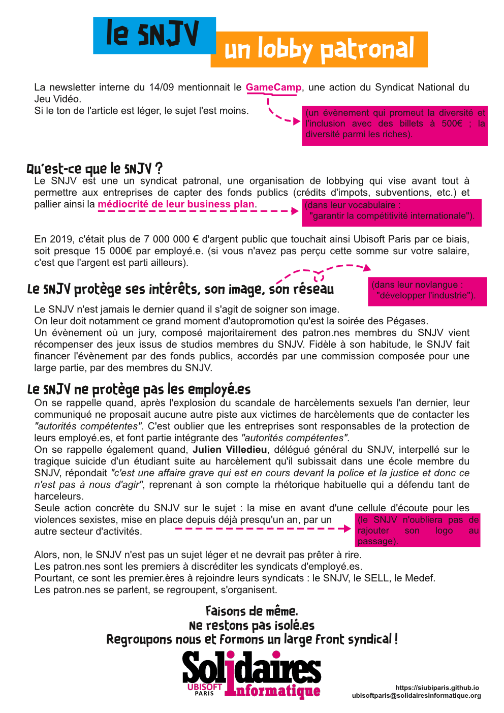

## Ubisoft : la défaite comme exemple

Pour lutter contre le harcèlement dans l'entreprise, le groupe Ubisoft veut mesurer davantage les compétences de ses salarié.es en ajoutant un sixième critère à l'actuel dispositif d'évaluations annuelles.
Votre manager évaluera ainsi votre exemplarité (comme votre "aptitude à mettre en place un environnement de travail sûr et inclusif", à "favoriser un dialogue continu sur ces thèmes", ou encore votre empathie). 

Hum. 

Cet attribut impactera votre augmentation annuelle.

Saisi par le CSE, le cabinet d'expertise chargé d'étudier le dispositif décrit un "projet non finalisé, dont beaucoup d’éléments sont encore à préciser, et dont le calendrier de déploiement semble trop rapide. "
Devant ce constat, la direction du studio décide naturellement de n'en rien changer, confortant son rôle de service après-vente du HQ d'Ubisoft. Seules quelques mesures annexes sont accordées, pour donner bonne figure.

### Cette mesure est un échec annoncé.
Elle veut régler un problème humain sous l'angle de l'argent, ce qui est déjà hautement discutable. Ce faisant, elle complexifie le système d'évaluations. Un système, lourd et complexe, dont l'objectif inavoué est surtout de fermer les discussions et maintenir les négociations dans des augmentations entre 1 et 5%. Or, on sait que des employé.es ont des augmentations de 10-15%, sans changement de responsabilités ou de postes.

### Loin de régler les problèmes de harcèlements au sein de l'entreprise, cette mesure les renforcera.
Une part importante des dysfonctionnements du groupe vient de la verticalité générale des relations au sein de  l'entreprise, la grande dépendance des employé.es vis-à-vis de leur manager et les difficultés pour les employé.es de faire remonter leurs problèmes.
C'est en toute logique qu'Ubisoft décide donc renforcer la verticalité, en accordant aux managers davantage de poids dans la rémunération de leur subordonné.es.
Sans compter le cas des managers peu exemplaires, toujours en activité dans le groupe, qui seront chargé.es d'évaluer l'exemplarité de leur subordonné.es.

Nous ne demandons rien à la direction d'Ubisoft Paris qui semble déterminée à ne plus entendre que la seule parole qui vient d'en haut. C'est donc aux employé.es que nous nous adressons.
La mise en place de cet attribut est juridiquement attaquable. Nous invitons tous les salarié.es qui se sentiraient flouées par ce nouvel attribut lors des prochaines évaluations à prendre contact avec le CSE et les syndicats et voir quelles actions collective peuvent être menées.
