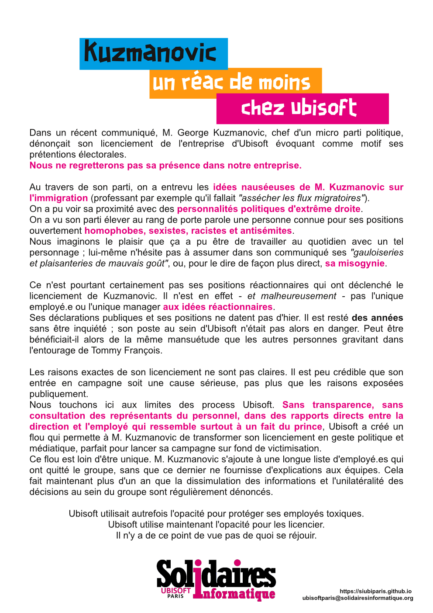

## Kuzmanovic : un réac de moins chez Ubi

Dans un récent communiqué, M. George Kuzmanovic, chef d'un micro parti politique, dénonçait son licenciement de l'entreprise d'Ubisoft évoquant comme motif ses prétentions électorales. 

Nous ne regretterons pas sa présence dans notre entreprise.

Au travers de son parti, on a entrevu les idées nauséeuses de M. Kuzmanovic sur l'immigration (professant par exemple qu'il fallait "assécher les flux migratoires"). 
On a pu voir sa proximité avec des personnalités politiques d'extrême droite. 
On a vu son parti élever au rang de porte parole une personne connue pour ses positions ouvertement homophobes, sexistes, racistes et antisémites.
Nous imaginons le plaisir que ça a du être de travailler au quotidien avec un tel personnage ; lui-même n'hésite pas à assumer dans son communiqué ses "gauloiseries et plaisanteries de mauvais goût", ou, pour le dire de façon plus direct, sa misogynie.

Ce n'est pourtant certainement pas ses positions réactionnaires qui ont déclenché le licenciement de Kuzmanovic. Il n'est en effet - et malheureusement - pas l'unique employé.e ou l'unique manager aux idées réactionnaires. Ses déclarations publiques et ses positions ne datent pas d'hier. Il est resté des années sans être inquiété ; son poste au sein d'Ubisoft n'était pas alors en danger. Peut être bénéficiait-il alors de la même mansuétude que les autres personnes gravitant dans l'entourage de Tommy François.

Les raisons exactes de son licenciement ne sont pas claires. Il est peu crédible que son entrée en campagne soit une cause sérieuse, pas plus que les raisons exposées publiquement.
Nous touchons ici aux limites des process Ubisoft. Sans transparence, sans consultation des représentants du personnel, dans des rapports directs entre la direction et l'employé qui ressemble surtout à un fait du prince, Ubisoft a créé un flou qui permette à M. Kuzmanovic de transformer son licenciement en geste politique et médiatique, parfait pour lancer sa campagne sur fond de victimisation. 
Ce flou est loin d'être unique. M. Kuzmanovic s'ajoute à une longue liste d'employé.es qui ont quitté le groupe, sans que ce dernier ne fournisse d'explications aux équipes. Cela fait maintenant plus d'un an que la dissimulation des informations et l'unilatéralité des décisions au sein du groupe sont régulièrement dénoncés.

Ubisoft utilisait l'opacité pour protéger ses employés toxiques.
Ubisoft utilise maintenant l'opacité pour les licencier.
Il n'y a pas de ce point de vue de quoi se réjouir.
