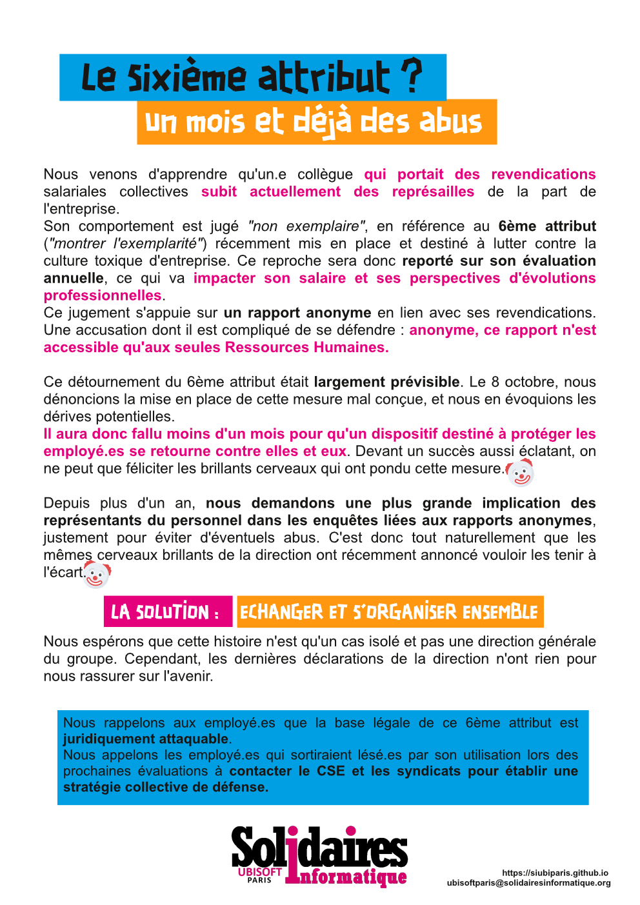

## Sixième Attribut : déjà les abus

Nous venons d'apprendre qu'un.e salarié.e du groupe Ubisoft qui portait des revendications collectives salariales subit actuellement des représailles de la part de l'entreprise. Son comportement est jugé "non exemplaire". Un reproche qui s'incarne dans le fameux 6ème critère d'évaluation ("montrer l'exemplarité") ce qui impacte son salaire et ses perspectives d'évolutions professionnelles.
Ce jugement s'appuie sur la base d'un rapport anonyme, en lien avec ses revendications. Une accusation dont il est compliqué de se défendre. Anonyme, ce rapport n'est accessible qu'aux seules Ressources Humaines.  

Ce retournement était largement prévisible. Le 8 octobre, nous dénoncions la mise en place du 6ème attribut, évoquant les dérives qu'il apportait.
Il aura dont fallu moins de 1 mois pour qu'un dispositif présenté pour lutter contre l'ornière toxique où se trouve l'entreprise se retourne contre les employé.es trop revendicatifs. Devant un succès aussi éclatant, on ne peut que féliciter les brillants cerveaux qui ont pondu cette mesure.

Depuis plus d'un an, nous demandons une plus grande implication des représentants du personnel dans les enquêtes liées aux rapports anonymes, justement pour éviter d'éventuels abus. C'est donc tout naturellement que les mêmes cerveaux brillants de la direction ont récemment annoncé vouloir les exclure.

### LA SOLUTION: ECHANGER ET S'ORGANISER ENSEMBLE

Nous espérons que cette histoire n'est qu'un cas isolé et pas une direction générale du groupe.
Cependant, les dernières déclarations de la direction n'ont rien pour nous rassurer sur l'avenir.

Nous rappelons aux employé.es que la base légale de ce 6ème attribut est juridiquement attaquable.
Nous appelons les employé.es qui sortiraient lésé.es par son utilisation lors des prochaines évaluations à contacter le CSE et les syndicats pour établir une stratégie collective de défense.
