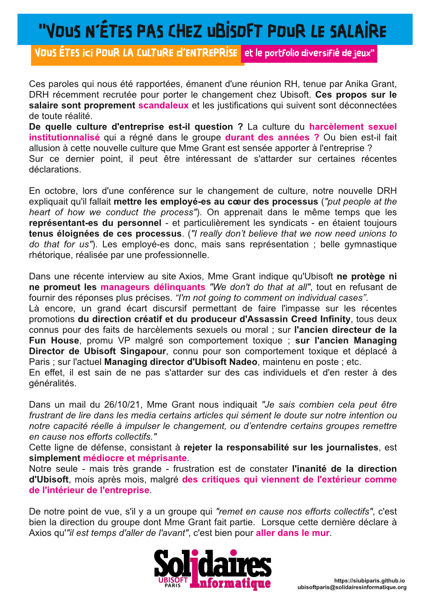

## Vous n'êtes pas chez Ubisoft pour le salaire
### Vous êtes ici pour la culture d'entreprise et la diversité des projets

Ces paroles qui nous été rapportées, émanent d'une réunion RH, tenue par Anika Grant, DRH récemment recrutée pour porter le changement chez Ubisoft. **Ces propos sur le salaire sont proprement scandaleux et les justifications qui suivent sont déconnectées de toute réalité.**

**De quelle culture d'entreprise est-il question ?** La culture du **harcèlement sexuel institutionnalisé** qui a régné dans le groupe **durant des années ?** Ou bien est-il fait allusion à cette nouvelle culture que Mme Grant est sensée apporter à l'entreprise ?
Sur ce dernier point, il peut être intéressant de s'attarder sur certaines récentes déclarations.

En octobre, lors d'une conférence sur le changement de culture, notre nouvelle DRH expliquait qu'il fallait **mettre les employé-es au cœur des processus** (*"put people at the heart of how we conduct the process"*). On apprenait dans le même temps que les représentant-es du personnel - et particulièrement les syndicats - en étaient toujours tenus éloignées de ces processus. (*"I really don’t believe that we now need unions to do that for us"*). Les employé-es donc, mais sans représentation ; belle gymnastique rhétorique, réalisée par une professionnelle.

Dans une récente interview au site Axios, Mme Grant indique qu'Ubisoft **ne protège ni ne promeut les managers délinquants** *"We don't do that at all"*, tout en refusant de fournir des réponses plus précises. *“I'm not going to comment on individual cases”*.
Là encore, un grand écart discursif permettant de faire l'impasse sur les récentes promotions **du directeur créatif et du produceur d'Assassin Creed Infinity**, tous deux connus pour des faits de harcèlements sexuels ou moral ; sur **l'ancien directeur de la Fun House**, promu VP malgré son comportement toxique ; **sur l'ancien Managing Director de Ubisoft Singapour**, connu pour son comportement toxique et déplacé à Paris ; **sur l'actuel Managing director d'Ubisoft Nadeo**, maintenu en poste ; etc. 
En effet, il est sain de ne pas s'attarder sur des cas individuels et d'en rester à des généralités.

Dans un mail du 26/10/21, Mme Grant nous indiquait *"Je sais combien cela peut être frustrant de lire dans les media certains articles qui sèment le doute sur notre intention ou notre capacité réelle à impulser le changement, ou d’entendre certains groupes remettre en cause nos efforts collectifs."*
Cette ligne de défense, consistant à **rejeter la responsabilité sur les journalistes, est simplement médiocre et méprisante.**
Notre seule - mais très grande - frustration est de constater **l'inanité de la direction d'Ubisoft**, mois après mois, malgré **des critiques qui viennent de l'extérieur comme de l'intérieur de l'entreprise**. 

De notre point de vue, s'il y a un groupe qui *"remet en cause nos efforts collectifs"*, c'est bien la direction du groupe dont Mme Grant fait partie.  Lorsque cette dernière déclare à Axios qu'*"il est temps d'aller de l'avant"*, c'est bien pour **aller dans le mur**.
