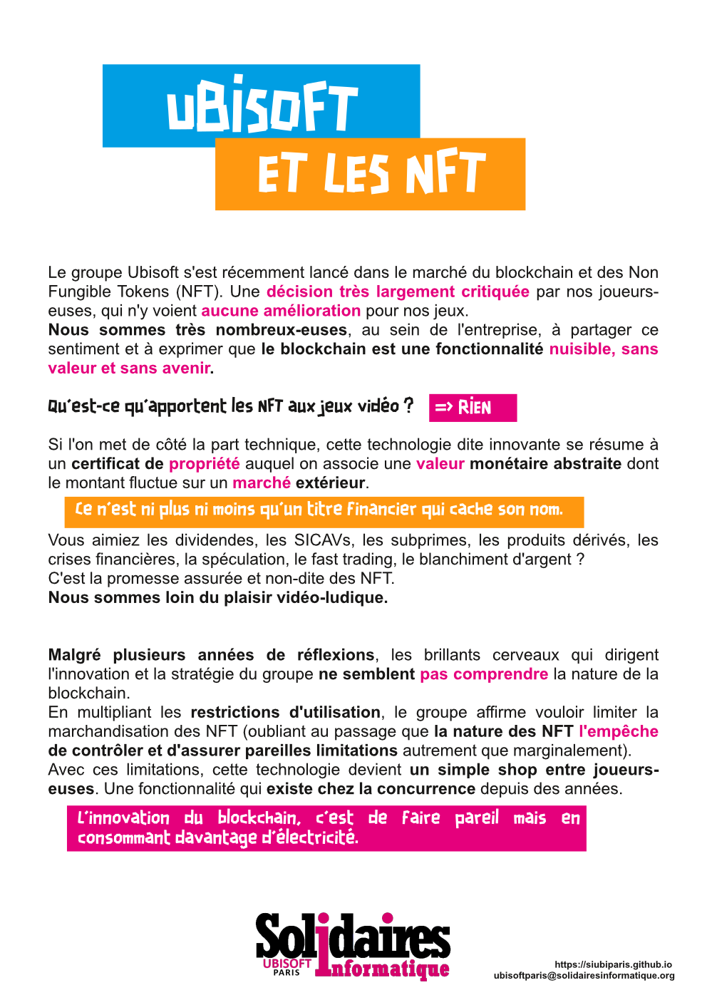
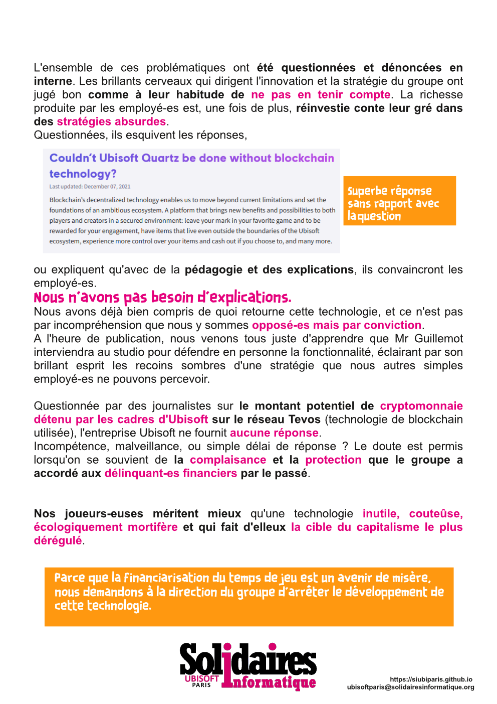

## UBISOFT
### et les NFT

Ubisoft s'est récemment lancé dans le marché du blockchain et des Non Fungible Tokens (NFT). Une décision très largement critiquée par nos joueurs-euses, qui n'y voient aucune amélioration pour nos jeux.
Nous sommes très nombreux-euses, au sein de l'entreprise, à partager ce sentiment et à exprimer que le blockchain est une fonctionnalité nuisible, sans valeur et sans avenir.

### Qu'est-ce qu'apportent les NFT aux jeux vidéo ?
Rien.
Si l'on met de côté la part technique, cette technologie dite innovante se résume à un certificat de propriété auquel on associe une valeur monétaire abstraite dont le montant fluctue sur un marché extérieur.
**Ce n'est ni plus ni moins qu'un titre financier qui cache son nom.**

Vous aimiez les dividendes, les SICAVs, les subprimes, les produits dérivés, les crises financières, la spéculation, le fast trading, le blanchiment d'argent, etc. ? C'est la promesse assurée et non-dite des NFT. 

**Nous sommes loin du plaisir vidéo-ludique.**

Malgré plusieurs années de réflexions, les brillants cerveaux qui dirigent l'innovation et la stratégie du groupe ne semblent pas comprendre la nature de la blockchain.
En multipliant les restrictions d'utilisation, le groupe affirme vouloir limiter la marchandisation des NFT (oubliant au passage que la nature des NFT l'empêche de contrôler et d'assurer pareilles limitations autrement que marginalement). 
Avec ces limitations, cette technologie devient un simple shop entre joueurs-euses. Une fonctionnalité qui existe chez la concurrence depuis des années. 

**L'innovation du blockchain, c'est de faire pareil mais en consommant davantage d'électricité.**

L'ensemble de ces problématiques ont été questionnées et dénoncées en interne. Les brillants cerveaux qui dirigent l'innovation et la stratégie du groupe ont jugé bon comme à leur habitude de n'en pas tenir compte. La richesse produite par les employé-es est, une fois de plus, réinvestie contre leur gré dans des stratégies absurdes.
Questionnées, ils esquivent les réponses, ou expliquent qu'avec de la pédagogie et des explications, ils convaincront les employé-es. 
###Nous n'avons pas besoin d'explications.
Nous avons déjà bien compris de quoi retourne cette technologie, et ce n'est pas par incompréhension que nous y sommes opposé-es mais par conviction.
A l'heure de publication, nous venons tous juste d'apprendre que Mr Guillemot interviendra au studio pour défendre en personne la fonctionnalité, éclairant par son brillant esprit les recoins sombres d'une stratégie que nous autres simples employé-es ne pouvons percevoir.

A l'inverse, l'incompréhension du sujet est palpable dans les directions de studios. En témoigne la directrice d'Ubisoft Paris qui justifie la technologie par la seule explication "Si Tarantino s'y met, c'est qu'on est au début de quelque chose". Un argument d’autorité mal placée qui met de coté que Miramax poursuit actuellement le réalisateur pour son usage du blockchain.

Questionnée par des journalistes sur le montant potentiel de cryptomonnaie détenu par les cadres d'Ubisoft sur le réseau Tevos (technologie de blockchain utilisée), l'entreprise Ubisoft ne fournit aucune réponse. Incompétence, malveillance, ou simple délai de réponse ? Le doute est permis lorsqu'on se souvient de la complaisance et la protection que le groupe a accordé aux délinquant-es financiers par le passé.

Nos joueurs-euses méritent mieux qu'une technologie inutile, couteûse, écologiquement mortifère et qui fait d'elleux la cible du capitalisme le plus dérégulé.

### Parce que la financiarisation du temps de jeu est un avenir de misère, nous demandons à la direction du groupe d'arrêter le développement de cette technologie.
