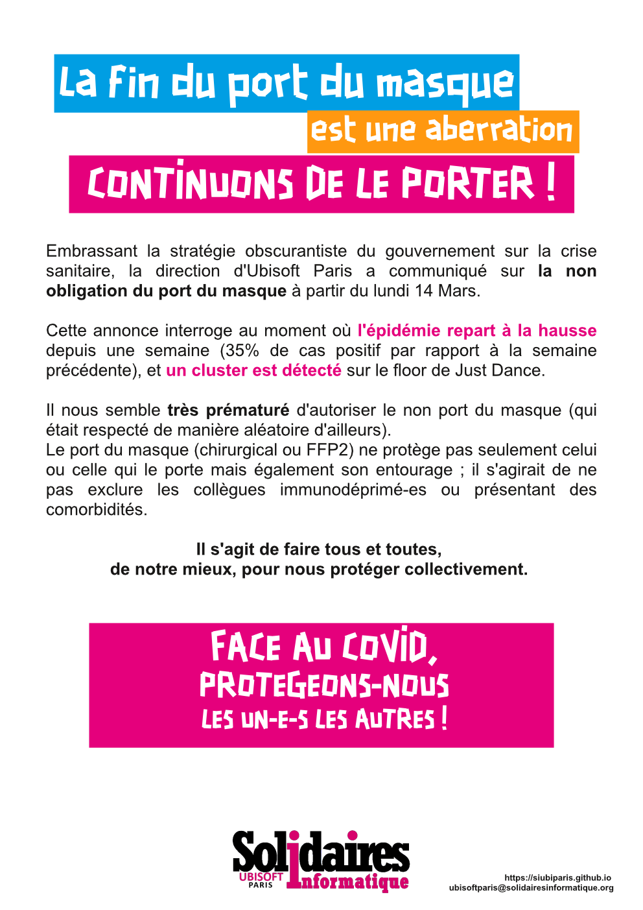

## La fin du port du masque est une aberration
### Continuons de le porter

Embrassant la stratégie obscurantiste du gouvernement sur la crise sanitaire, la direction d'Ubisoft Paris a communiqué sur la non obligation du port du masque à partir du lundi 14 Mars.

Cette annonce interroge au moment où l'épidémie repart à la hausse depuis une semaine (35% de cas positif par rapport à la semaine précédente), et un cluster est détecté sur le floor de Just Dance.

Il nous semble très prématuré d'autoriser le non port du masque (qui était respecté de manière aléatoire d'ailleurs). Le port du masque (chirurgical ou FFP2) ne protège pas seulement celui ou celle qui le porte mais également son entourage ; il s'agirait de ne pas exclure les collègues immunodéprimés ou présentant des comorbidités. 
Il s'agit de faire tous et toutes, de notre mieux, pour nous protéger collectivement. 

FACE AU COVID,
PROTEGEONS-NOUS
LES UN-E-S LES AUTRES !

