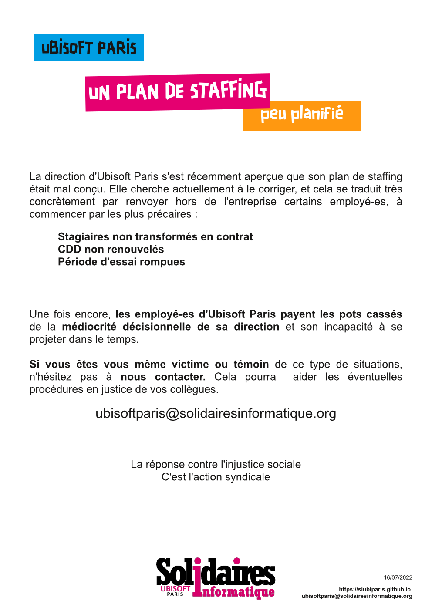

La direction d'Ubisoft Paris s'est récemment aperçue que son plan de staffing était mal conçu.
Elle cherche actuellement à le corriger, et cela se traduit très concrètement par renvoyer hors de l'entreprise certains employé-es, à commencer par les plus précaires :

- Stagiaires non transformés en contrat
- CDD non renouvelés
- Période d'essai rompues

Une fois encore, les employé-es d'Ubisoft Paris payent les pots cassés de la médiocrité décisionnelle de sa direction et son incapacité à se projeter dans le temps.

Si vous êtes vous même victime ou témoin de ce type de situations, n'hésitez pas à nous contacter. Cela pourra  aider les éventuelles procédures en justice de vos collègues.

ubisoftparis@solidairesinformatique.org

La réponse contre l'injustice sociale

C'est l'action syndicale
