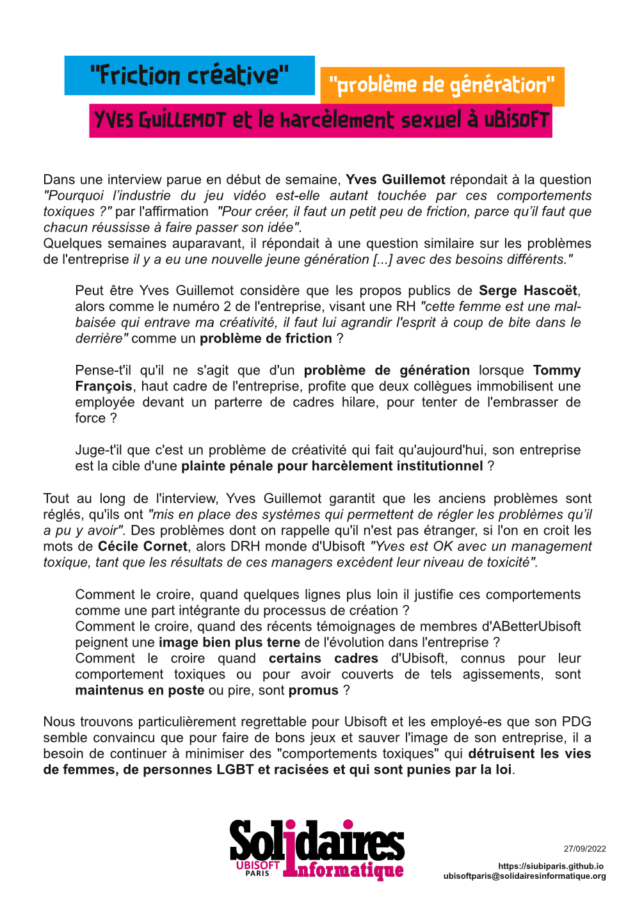

Dans une interview parue en début de semaine, **Yves Guillemot** répondait à la question *"Pourquoi l’industrie du jeu vidéo est-elle autant touchée par ces comportements toxiques ?"* par l'affirmation  *"Pour créer, il faut un petit peu de friction, parce qu’il faut que chacun réussisse à faire passer son idée".*
Quelques semaines auparavant, il affirmait à une question similaire que les problèmes de l'entreprise étaient dûs à un problème générationnel *"il y a eu une nouvelle jeune génération [...] avec des besoins différents."*

Peut être Yves Guillemot considère que les propos publics de **Serge Hascoët**, alors comme le numéro 2 de l'entreprise, visant une RH *"cette femme est une mal-baisée qui entrave ma créativité, il faut lui agrandir l'esprit à coup de bite dans le derrière"* comme un problème de friction ?

Pense-t'il qu'il ne s'agit que d'un problème de génération lorsque **Tommy François**, haut cadre de l'entreprise, profite que deux collègues immobilisent une employée devant un parterre de cadres hilare, pour tenter de l'embrasser de force ?

Juge-t'il que c'est un problème de créativité qui fait qu'aujourd'hui, son entreprise est la cible d'une **plainte pénale pour harcèlement institutionnel** ?

Tout au long de l'interview, Yves Guillemot garantit que les anciens problèmes sont réglés, qu'ils ont *"mis en place des systèmes qui permettent de régler les problèmes qu’il a pu y avoir"*. Des problèmes dont on rappelle qu'il n'est pas étranger, si l'on en croit les mots de **Cécile Cornet**, alors DRH monde d'Ubisoft *"Yves est OK avec un management toxique, tant que les résultats de ces managers excèdent leur niveau de toxicité".*
Comment le croire, quand quelques lignes plus loin il justifie ces comportements comme une part intégrante du processus de création ? 
Comment le croire, quand des récents témoignages de membres d'ABetterUbisoft peignent une image bien plus terne de l'évolution dans l'entreprise ? 
Comment le croire quand certains cadres d'Ubisoft, connus pour leur comportement toxiques ou pour avoir couverts de tels agissements, sont maintenus en poste ou pire, sont promus ?

Nous trouvons particulièrement regrettable pour Ubisoft et les employé-es que son PDG semble convaincu que pour faire de bons jeux et sauver l'image de son entreprise, il a besoin de continuer à minimiser des "comportements toxiques" qui détruisent les vies de femmes, de personnes LGBT et racisées et qui sont punies par la loi.
