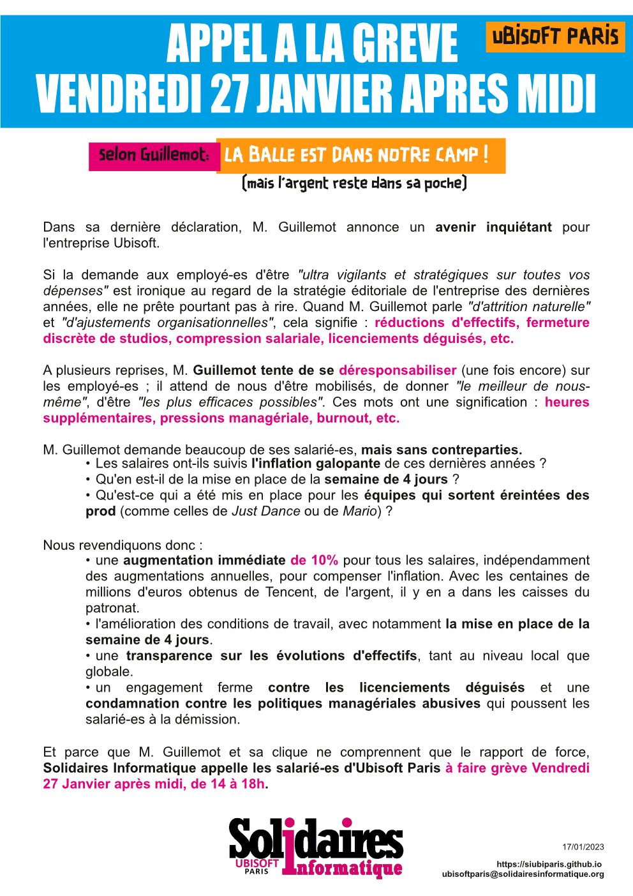
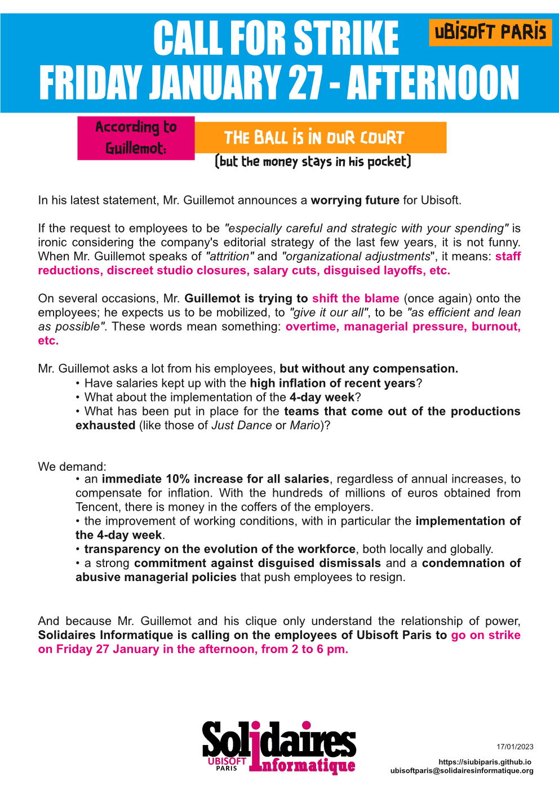

*(english below)*

### APPEL A LA GREVE: VENDREDI 27 APRES MIDI

Selon Guillemot: LA BALLE EST DANS NOTRE CAMP ! *(mais l'argent reste dans sa poche)*

Dans sa dernière déclaration, M. Guillemot annonce **un avenir inquiétant** pour l'entreprise Ubisoft.

Si la demande aux employé-es d'être *"ultra vigilants et stratégiques sur toutes vos dépenses"* est ironique au regard de la stratégie éditoriale de l'entreprise des dernières années, elle ne prête pourtant pas à rire. Quand M. Guillemot parle *"d'attrition naturelle"* et *"d'ajustements organisationnelles"*, cela signifie : **réductions d'effectifs, fermeture discrète de studios, compression salariale, licenciements déguisés, etc.**

A plusieurs reprises, M. Guillemot tente de se déresponsabiliser (une fois encore) sur les employé-es ; il attend de nous d'être mobilisés, de donner *"le meilleur de nous-même"*, d'être *"les plus efficaces possibles"*. Ces mots ont une signification : **heures supplémentaires, pressions managériale, burnout, etc.**

M. Guillemot demande beaucoup de ses salarié-es, mais sans contreparties.
- Les salaires ont-ils suivis l'inflation galopante de ces dernières années ?
- Qu'en est-il de la mise en place de la semaine de 4 jours ?
- Qu'est-ce qui a été mis en place pour les équipes qui sortent éreintées des prod (comme celles de Just Dance ou de Mario) ?

Nous revendiquons donc :
- une augmentation immédiate de 10% pour tous les salaires, indépendamment des augmentations annuelles, pour compenser l'inflation. Avec les centaines de millions d'euros obtenus de Tencent, de l'argent, il y en a dans les caisses du patronat.
- l'amélioration des conditions de travail, avec notamment la mise en place de la semaine de 4 jours.
- une transparence sur les évolutions d'effectifs, tant au niveau local que globale.
- un engagement ferme contre les licenciements déguisés et une condamnation contre les politiques managériales abusives qui poussent les salarié-es à la démission.

Et parce que M. Guillemot et sa clique ne comprennent que le rapport de force, **Solidaires Informatique appelle les salarié-es d'Ubisoft Paris à faire grève Vendredi 27 Janvier après midi, de 14 à 18h.

### CALL FOR STRIKE: FRIDAY JANUARY 27 - AFTERNOON

According to Guillemot: The Ball is in our court *(but the money stays in his pocket)*

In his latest statement, Mr. Guillemot announces a **worrying future** for Ubisoft.

If the request to employees to be *"especially careful and strategic with your spending"* is ironic considering the company's editorial strategy of the last few years, it is not funny. When Mr. Guillemot speaks of *"attrition"* and *"organizational adjustments"*, it means: **staff reductions, discreet studio closures, salary cuts, disguised layoffs, etc.**

On several occasions, Mr. Guillemot is trying to shift the blame (once again) onto the employees; he expects us to be mobilized, to *"give it our all"*, to be *"as efficient and lean as possible"*. These words mean something: **overtime, managerial pressure, burnout, etc.**

Mr. Guillemot asks a lot from his employees, but without any compensation.
- Have salaries kept up with the high inflation of recent years?
- What about the implementation of the 4-day week?
- What has been put in place for the teams that come out of the productions exhausted (like those of Just Dance or Mario)?

We demand:
- an immediate 10% increase for all salaries, regardless of annual increases, to compensate for inflation. With the hundreds of millions of euros obtained from Tencent, there is money in the coffers of the employers.
- the improvement of working conditions, with in particular the implementation of the 4-day week.
- transparency on the evolution of the workforce, both locally and globally.
- a strong commitment against disguised dismissals and a condemnation of abusive managerial policies that push employees to resign.

And because Mr. Guillemot and his clique only understand the relationship of power, **Solidaires Informatique is calling on the employees of Ubisoft Paris to go on strike on Friday 27 January in the afternoon, from 2 to 6 pm.**

