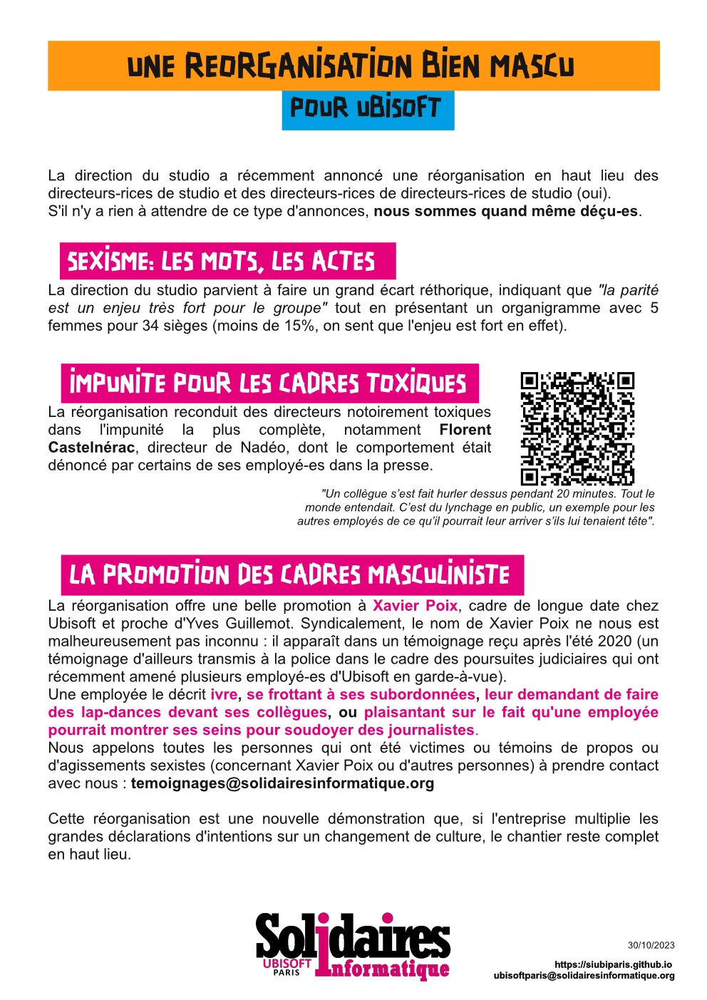

# UBISOFT - Une réorganisation bien mascu

La direction du studio a récemment annoncé une réorganisation en haut lieu des directeurs-rices de studio et des directeurs-rices de directeurs-rices de studio (oui).
S'il n'y a rien à attendre de ce type d'annonces, nous sommes quand même déçu-es.

## Sexisme : les mots, les actes
La direction du studio parvient à faire un grand écart réthorique, indiquant que "la parité est un enjeu très fort pour le groupe" tout en présentant un organigramme avec 5 femmes pour 34 sièges (moins de 15%, on sent que l'enjeu est fort).

## Impunité pour les cadres toxiques
La réorganisation reconduit des directeurs notoirement toxiques dans l'impunité la plus complète, notamment Florent Castelnérac, directeur de Nadéo, dont le comportement était dénoncé par ses employé-es dans la presse 

* "Un collègue s’est fait hurler dessus pendant 20 minutes. Tout le monde entendait. C’est du lynchage en public, un exemple pour les autres employés de ce qu’il pourrait leur arriver s’ils lui tenaient tête".
* https://www.numerama.com/politique/646826-tu-vas-pleurer-les-premieres-fois-que-se-passe-t-il-au-sein-du-studio-dubisoft-derriere-trackmania.html

## Promotion des cadres masculinistes
La réorganisation offre une promotion à Xavier Poix, cadre de longue date chez Ubisoft et proche d'Yves Guillemot. Syndicalement, le nom de Xavier Poix ne nous est malheureusement pas inconnu :il apparaît dans un témoignage reçu après l'été 2020 (un témoignage d'ailleurs transmis à la police dans le cadre des poursuites judiciaires qui ont récemment amené plusieurs employé-es d'Ubisoft en garde-à-vue). 
Une employée le décrit ivre, se frottant à ses subordonnées, leur demandant de faire des lap-dances devant les collègues, ou plaisantant sur le fait qu'une employée pourrait montrer ses seins pour soudoyer des journalistes.
Nous appelons toutes les personnes qui ont été victimes ou témoins de propos ou d'agissements sexistes (concernant Xavier Poix ou d'autres personnes) à prendre contact avec nous : temoignages@solidairesinformatique.org

Cette réorganisation est une nouvelle démonstration que, si l'entreprise multiplie les grandes déclarations d'intentions sur un changement de culture, le chantier reste complet en haut lieu.

