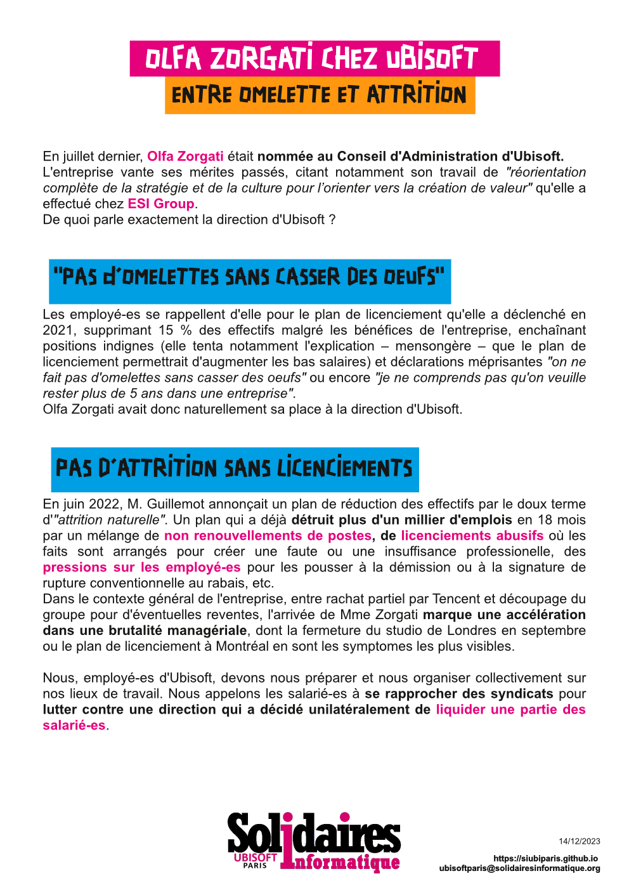

# Olfa Zorgati chez Ubisoft
## Entre omelette et attrition

En juillet dernier, Olfa Zorgati était nommée au Conseil d'Administration d'Ubisoft.
L'entreprise vante ses mérites passés, citant notamment son travail de "réorientation complète de la stratégie et de la culture pour l’orienter vers la création de valeur" qu'elle a effectué chez ESI Group. 
De quoi parle exactement la direction d'Ubisoft ?

### "Pas d'omelette sans casser des oeufs"
Les employé-es se rappellent d'elle pour le plan de licenciement qu'elle a déclenché en 2021, supprimant 15 % des effectifs malgré les bénéfices de l'entreprise, enchaînant positions indignes (elle tenta notamment l'explication – mensongère – que le plan de licenciement permettrait d'augmenter les bas salaires) et déclarations méprisantes "on ne fait pas d'omelettes sans casser des oeufs" ou encore "je ne comprends pas qu'on veuille rester plus de 5 ans dans une entreprise". Olfa Zorgati avait donc naturellement sa place à la direction d'Ubisoft.

### Pas d'attrition sans licenciements
En juin 2022, M. Guillemot annonçait un plan de réduction des effectifs par le doux terme d'"attrition naturelle". Un plan qui a déjà détruit plus d'un millier d'emplois en 18 mois par un mélange de non renouvellements de postes, de licenciements abusifs où les faits sont arrangés pour créer une faute ou une insuffisance professionelle, des pressions sur les employé-es pour les pousser à la démission ou à la signature de rupture conventionnelle au rabais, etc.
Dans le contexte général de l'entreprise, entre rachat partiel par Tencent et découpage du groupe pour d'éventuelles reventes, l'arrivée de Mme Zorgati marque une accélération dans une brutalité managériale, dont la fermeture du fermeture du studio de Londres en septembre ou le plan de licenciement à Montréal en sont les symptomes les plus visibles.
Nous, employé-es d'Ubisoft, devons nous préparer et nous organiser collectivement sur nos lieux de travail. Nous appelons les salarié-es à se rapprocher des syndicats pour lutter contre une direction qui a décidé unilatéralement de liquider une partie des salarié-es. 
