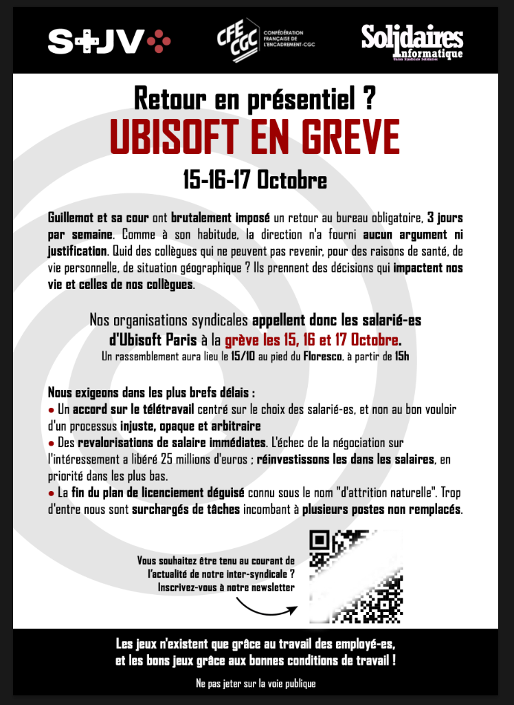

Guillemot et sa cour ont brutalement imposé un retour au bureau obligatoire, 3 jours par semaine. Comme à son habitude, la direction n'a fourni aucun argument ni justification. Quid des collègues qui ne peuvent pas revenir, pour des raisons de santé, de vie personnelle, de situation géographique ? Ils prennent des décisions qui impactent nos vie et celles de nos collègues.

Nos organisations syndicales appellent donc les salarié-es d'Ubisoft Paris à la grève les 15, 16 et 17 Octobre.

Un rassemblement aura lieu le 15/10 au pied du Floresco, à partir de 15h

Nous exigeons dans les plus brefs délais :
- Un accord sur le télétravail centré sur le choix des salarié-es, et non au bon vouloir d'un processus injuste, opaque et arbitraire.
- Des revalorisations de salaires immédiates. L'échec de la négociation sur l'intéressement a libéré 25 millions d'euros : réinvestissons les dans les salaires, en priorité dans les plus bas.
- La fin du plan de licenciement déguisé connu sous le nom "d'attrition naturelle". Trop d'entre nous sont surchargés de tâches incombant à plusieurs postes non remplacés.
   
Les jeux n'existent que grâce au travail des employé-es,

et les bons jeux grâce aux bonnes conditions de travail !

