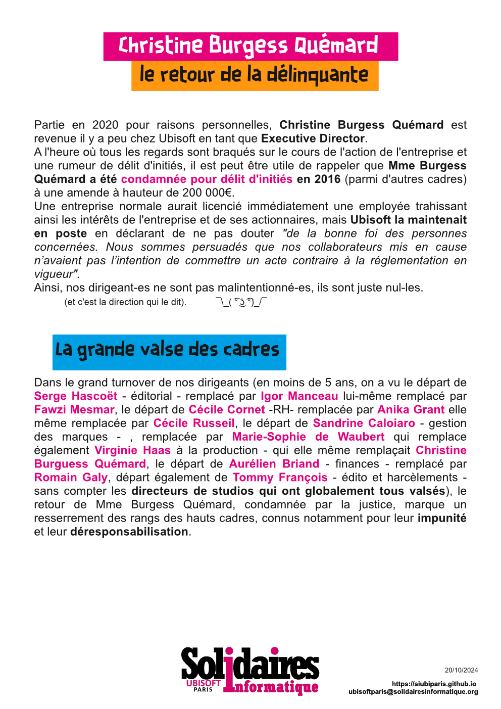

Partie en 2020 pour raisons personnelles, Christine Burgess Quémard est revenue il y a peu chez Ubisoft en tant que Executive Director.
A l'heure où tous les regards sont braqués sur le cours de l'action de l'entreprise et une rumeur de délit d'initiés, il est peut être utile de rappeler que Mme Burgess Quémard a été condamnée pour délit d'initiés en 2016 (parmi d'autres cadres) à une amende à hauteur de 200 000€. 
Une entreprise normale aurait licencié immédiatement une employée trahissant ainsi les intérêts de l'entreprise et de ses actionnaires, mais Ubisoft la maintenait en poste en déclarant de ne pas douter _"de la bonne foi des personnes concernées. Nous sommes persuadés que nos collaborateurs mis en cause n’avaient pas l’intention de commettre un acte contraire à la réglementation en vigueur"._ 

Ainsi, nos dirigeant-es ne sont pas malintentionné-es, ils sont juste nul-les. 

_(et c'est la direction qui le dit)._	¯\_( ͡° ͜ʖ ͡°)_/¯

## La grande valse des cadres

Dans le grand turnover de nos dirigeants (en moins de 5 ans, on a vu le départ de **Serge Hascoët** - éditorial - remplacé par **Igor Manceau** lui-même remplacé par **Fawzi Mesmar**, le départ de **Cécile Cornet** -RH- remplacée par **Anika Grant** elle même remplacée par **Cécile Russeil**, le départ de **Sandrine Caloiaro** - gestion des marques - , remplacée par **Marie-Sophie de Waubert** qui remplace également **Virginie Haas** à la production - qui elle même remplaçait **Christine Burguess Quémard**, le départ de **Aurélien Briand** - finances - remplacé par **Romain Galy**, départ également de **Tommy François** - édito et harcèlements - sans compter les directeurs de studios qui ont globalement tous valsés), le retour de Mme Burgess Quémard, condamnée par la justice, marque un resserrement des rangs des hauts cadres, connus notamment pour leur impunité et leur déresponsabilisation.
