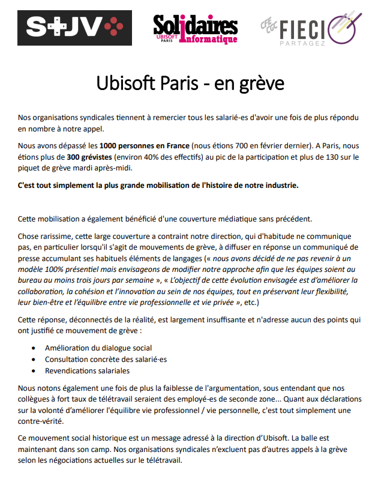
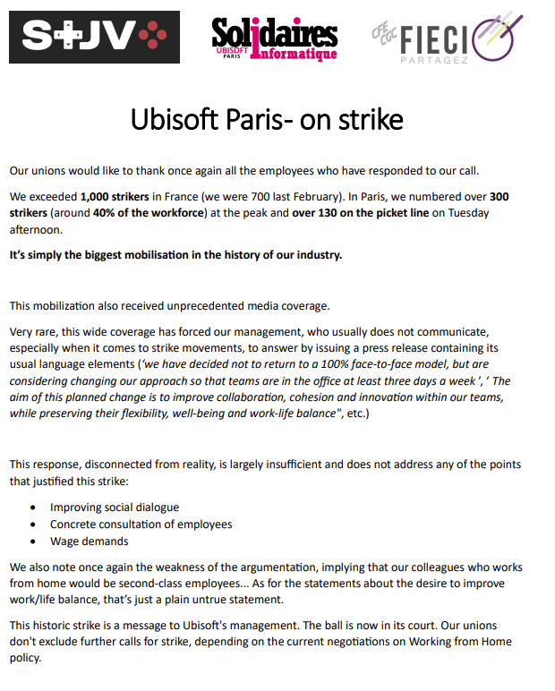

English Below

Nos organisations syndicales tiennent à remercier tous les salarié-es d'avoir une fois de plus répondu en nombre à notre appel. 
Nous avons dépassé les 1000 personnes en France (nous étions 700 en février dernier). A Paris, nous étions plus de 300 grévistes (environ 40% des effectifs) au pic de la participation et plus de 130 sur le piquet de grève mardi après-midi.

C'est tout simplement la plus grande mobilisation de l'histoire de notre industrie.

Cette mobilisation a également bénéficié d'une couverture médiatique sans précédent.

Chose rarissime, cette large couverture a contraint notre direction, qui d'habitude ne communique pas, en particulier lorsqu'il s'agit de mouvements de grève, à diffuser en réponse un communiqué de presse accumulant ses habituels éléments de langages (« nous avons décidé de ne pas revenir à un modèle 100% présentiel mais envisageons de modifier notre approche afin que les équipes soient au bureau au moins trois jours par semaine », « L’objectif de cette évolution envisagée est d’améliorer la collaboration, la cohésion et l’innovation au sein de nos équipes, tout en préservant leur flexibilité, leur bien-être et l’équilibre entre vie professionnelle et vie privée », etc.)

Cette réponse, déconnectés de la réalité, est largement insuffisante et n'adresse aucun des points qui ont justifié ce mouvement de grève :
•	Amélioration du dialogue social
•	Consultation concrète des salarié·es
•	Revendications salariales

Nous notons également une fois de plus la faiblesse de l'argumentation, sous entendant que nos collègues à fort taux de télétravail seraient des employé-es de seconde zone... Quant aux déclarations sur la volonté d’améliorer l'équilibre vie professionnel / vie personnelle, c'est tout simplement une contre-vérité. 

Ce mouvement social historique est un message adressé à la direction d’Ubisoft. La balle est maintenant dans son camp. Nos organisations syndicales n’excluent pas d’autres appels à la grève selon les négociations actuelles sur le télétravail.

Our unions would like to thank once again all the employees who have responded to our call.
We exceeded 1,000 strikers in France (we were 700 last February). In Paris, we numbered over 300 strikers (around 40% of the workforce) at the peak and over 130 on the picket line on Tuesday afternoon.
It’s simply the biggest mobilisation in the history of our industry.
This mobilization also received unprecedented media coverage. 
Very rare, this wide coverage has forced our management, who usually does not communicate, especially when it comes to strike movements, to answer by issuing a press release containing its usual language elements (‘we have decided not to return to a 100% face-to-face model, but are considering changing our approach so that teams are in the office at least three days a week ’, ‘ The aim of this planned change is to improve collaboration, cohesion and innovation within our teams, while preserving their flexibility, well-being and work-life balance", etc.)
This response, disconnected from reality, is largely insufficient and does not address any of the points that justified this strike:
•	Improving social dialogue
•	Concrete consultation of employees
•	Wage demands
We also note once again the weakness of the argumentation, implying that our colleagues who works from home would be second-class employees... As for the statements about the desire to improve work/life balance, that’s just a plain untrue statement.
This historic strike is a message to Ubisoft's management. The ball is now in its court. Our unions don't exclude further calls for strike, depending on the current negotiations on Working from Home policy.
