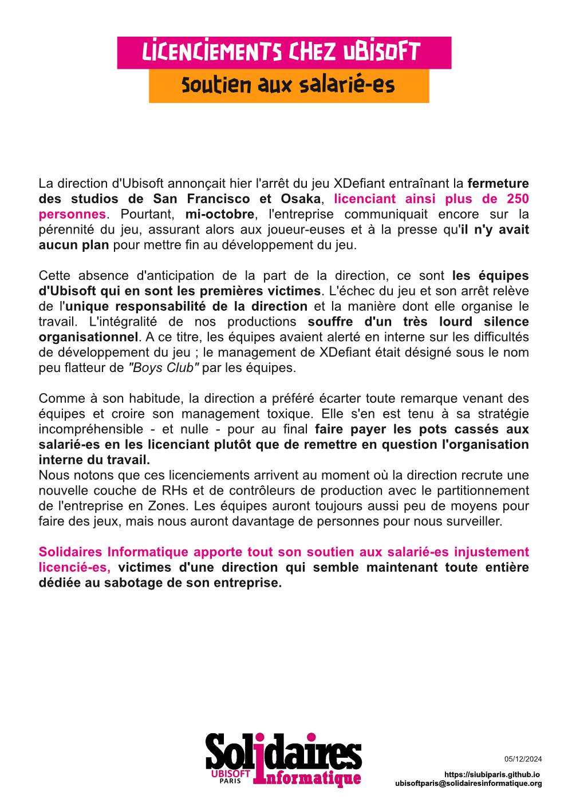
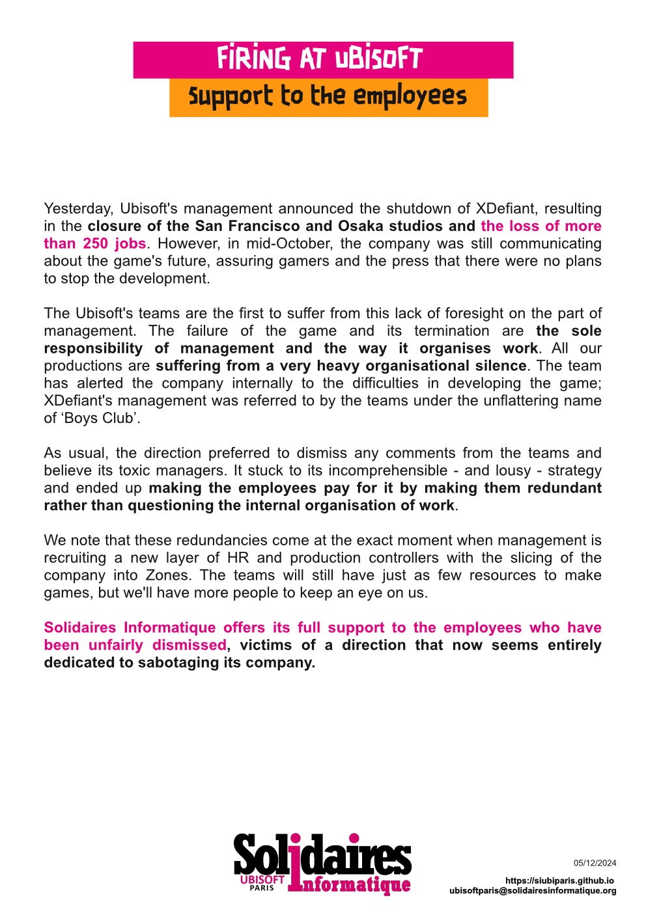

English Below

La direction d'Ubisoft annonçait hier l'arrêt du jeu XDefiant entraînant la fermeture des studios de San Francisco et Osaka, licenciant ainsi plus de 250 personnes. Pourtant, mi-octobre, l'entreprise communiquait encore sur la pérennité du jeu, assurant alors aux joueur-euses et à la presse qu'il n'y avait aucun plan pour mettre fin au développement du jeu.

Cette absence d'anticipation de la part de la direction, ce sont les équipes d'Ubisoft qui en sont les premières victimes. L'échec du jeu et son arrêt relève de l'unique responsabilité de la direction et la manière dont elle organise le travail. L'intégralité de nos productions souffre d'un très lourd silence organisationnel. A ce titre, les équipes avaient alerté en interne sur les difficultés de développement du jeu ; le management de XDefiant était désigné sous le nom peu flatteur de "Boys Club" par les équipes.

Comme à son habitude, la direction a préféré écarter toute remarque venant des équipes et croire son management toxique. Elle s'en est tenu à sa stratégie incompréhensible - et nulle - pour au final faire payer les pots cassés aux salarié-es en les licenciant plutôt que de remettre en question l'organisation interne du travail.
Nous notons que ces licenciements arrivent au moment où la direction recrute une nouvelle couche de RHs et de contrôleurs de production avec le partitionnement de l'entreprise en Zones. Les équipes auront toujours aussi peu de moyens pour faire des jeux, mais nous auront davantage de personnes pour nous surveiller.

Solidaires Informatique apporte tout son soutien aux salarié-es injustement licencié-es, victimes d'une direction qui semble maintenant toute entière dédiée au sabotage de son entreprise.

=========================

Yesterday, Ubisoft's management announced the shutdown of XDefiant, resulting in the closure of the San Francisco and Osaka studios and the loss of more than 250 jobs. However, in mid-October, the company was still communicating about the game's future, assuring gamers and the press that there were no plans to stop the development.

The Ubisoft's teams are the first to suffer from this lack of foresight on the part of management. The failure of the game and its termination are the sole responsibility of management and the way it organises work. All our productions are suffering from a very heavy organisational silence. The team has alerted the company internally to the difficulties in developing the game; XDefiant's management was referred to by the teams under the unflattering name of ‘Boys Club’.

As usual, the direction preferred to dismiss any comments from the teams and believe its toxic managers. It stuck to its incomprehensible - and lousy - strategy and ended up making the employees pay for it by making them redundant rather than questioning the internal organisation of work.

We note that these redundancies come at the exact moment when management is recruiting a new layer of HR and production controllers with the slicing of the company into Zones. The teams will still have just as few resources to make games, but we'll have more people to keep an eye on us.

Solidaires Informatique offers its full support to the employees who have been unfairly dismissed, victims of a direction that now seems entirely dedicated to sabotaging its company.

