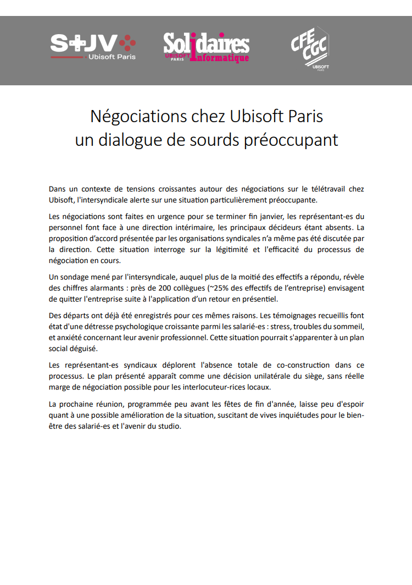

Dans un contexte de tensions croissantes autour des négociations sur le télétravail chez Ubisoft, l'intersyndicale alerte sur une situation particulièrement préoccupante. 

Les négociations sont faites en urgence pour se terminer fin janvier, les représentant-es du personnel font face à une direction intérimaire, les principaux décideurs étant absents. La proposition d’accord présentée par les organisations syndicales n’a même pas été discutée par la direction. Cette situation interroge sur la légitimité et l'efficacité du processus de négociation en cours. 

Un sondage mené par l'intersyndicale, auquel plus de la moitié des effectifs a répondu, révèle des chiffres alarmants : près de 200 collègues (~25% des effectifs de l’entreprise) envisagent de quitter l'entreprise suite à l'application d’un retour en présentiel. 

Des départs ont déjà été enregistrés pour ces mêmes raisons. Les témoignages recueillis font état d'une détresse psychologique croissante parmi les salarié-es : stress, troubles du sommeil, et anxiété concernant leur avenir professionnel. Cette situation pourrait s'apparenter à un plan social déguisé. 

Les représentant-es syndicaux déplorent l'absence totale de co-construction dans ce processus. Le plan présenté apparaît comme une décision unilatérale du siège, sans réelle marge de négociation possible pour les interlocuteur-rices locaux. 

La prochaine réunion, programmée peu avant les fêtes de fin d'année, laisse peu d'espoir quant à une possible amélioration de la situation, suscitant de vives inquiétudes pour le bien-être des salarié-es et l'avenir du studio.

