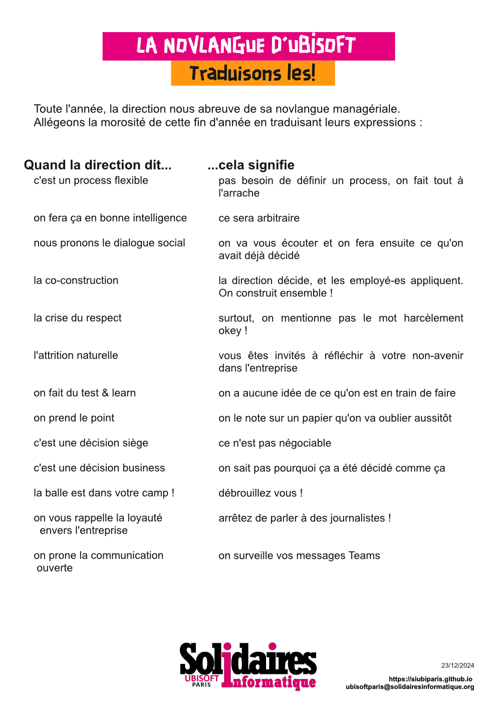

Toute l'année, la direction nous abreuve de sa novlangue managériale.

Allégeons la morosité de cette fin d'année en traduisant leurs expressions !

Quand la direction dit...    ...cela signifie:

"c'est un process flexible" : pas besoin de définir un process, on fait tout à l'arrache

"on fera ça en bonne intelligence" : ce sera arbitraire

"nous pronons le dialogue social" : on va vous écouter et on fera ensuite ce qu'on avait déjà décidé

"la co-construction" : la direction décide, et les employé-es appliquent. On construit ensemble !

"la crise du respect" : surtout, on mentionne pas le mot harcèlement okey !

"l'attrition naturelle" : vous êtes invités à réfléchir à votre non-avenir dans l'entreprise

"on fait du test & learn" : on a aucune idée de ce qu'on est en train de faire

"on prend le point" : on le note sur un papier qu'on va oublier aussitôt

"c'est une décision siège" : ce n'est pas négociable

"c'est une décision business" : on sait pas pourquoi ça a été décidé comme ça

"la balle est dans votre camp !" : débrouillez vous !

"on vous rappelle la loyauté envers l'entreprise" : arrêtez de parler à des journalistes !

"on prone la communication ouverte" : on surveille vos messages Teams
