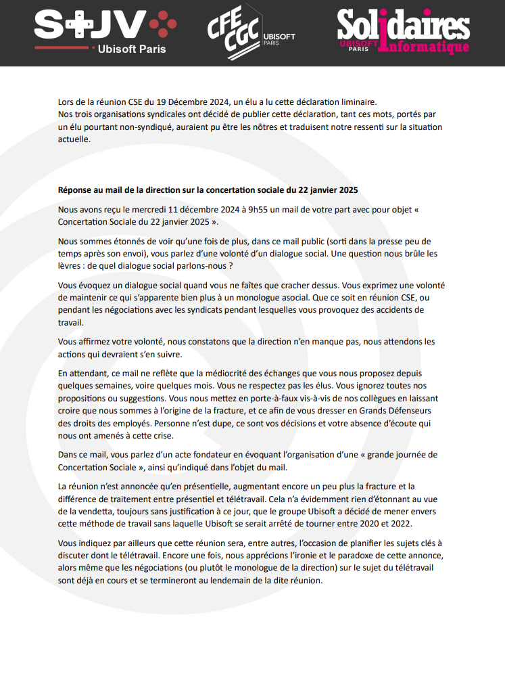
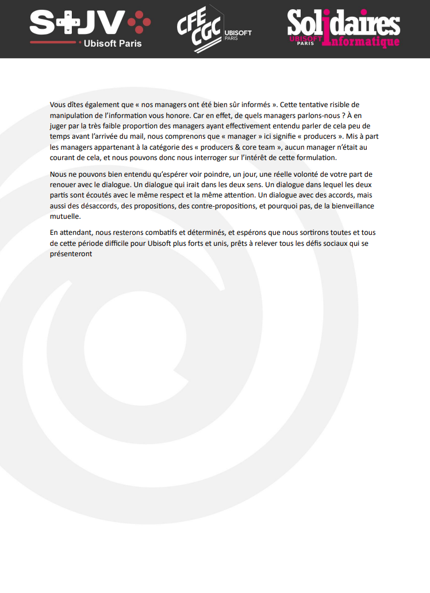

Lors de la réunion CSE du 19 Décembre 2024, un élu a lu cette déclaration liminaire.
Nos trois organisations syndicales ont décidé de publier cette déclaration, tant ces mots, portés par un élu pourtant non-syndiqué, auraient pu être les nôtres et traduisent notre ressenti sur la situation actuelle.

# Réponse au mail de la direction sur la concertation sociale du 22 janvier 2025 

Nous avons reçu le mercredi 11 décembre 2024 à 9h55 un mail de votre part avec pour objet « Concertation Sociale du 22 janvier 2025 ». 

Nous sommes étonnés de voir qu’une fois de plus, dans ce mail public (sorti dans la presse peu de temps après son envoi), vous parlez d’une volonté d’un dialogue social. Une question nous brûle les lèvres : de quel dialogue social parlons-nous ? 

Vous évoquez un dialogue social quand vous ne faîtes que cracher dessus. Vous exprimez une volonté de maintenir ce qui s’apparente bien plus à un monologue asocial. Que ce soit en réunion CSE, ou pendant les négociations avec les syndicats pendant lesquelles vous provoquez des accidents de travail. 

Vous affirmez votre volonté, nous constatons que la direction n’en manque pas, nous attendons les actions qui devraient s’en suivre. 

En attendant, ce mail ne reflète que la médiocrité des échanges que vous nous proposez depuis quelques semaines, voire quelques mois. Vous ne respectez pas les élus. Vous ignorez toutes nos propositions ou suggestions. Vous nous mettez en porte-à-faux vis-à-vis de nos collègues en laissant croire que nous sommes à l’origine de la fracture, et ce afin de vous dresser en Grands Défenseurs des droits des employés. Personne n’est dupe, ce sont vos décisions et votre absence d’écoute qui nous ont amenés à cette crise. 

Dans ce mail, vous parlez d’un acte fondateur en évoquant l’organisation d’une « grande journée de Concertation Sociale », ainsi qu’indiqué dans l’objet du mail. 

La réunion n’est annoncée qu’en présentielle, augmentant encore un peu plus la fracture et la différence de traitement entre présentiel et télétravail. Cela n’a évidemment rien d’étonnant au vue de la vendetta, toujours sans justification à ce jour, que le groupe Ubisoft a décidé de mener envers cette méthode de travail sans laquelle Ubisoft se serait arrêté de tourner entre 2020 et 2022. 

Vous indiquez par ailleurs que cette réunion sera, entre autres, l’occasion de planifier les sujets clés à discuter dont le télétravail. Encore une fois, nous apprécions l’ironie et le paradoxe de cette annonce, alors même que les négociations (ou plutôt le monologue de la direction) sur le sujet du télétravail sont déjà en cours et se termineront au lendemain de la dite réunion. 

Vous dîtes également que « nos managers ont été bien sûr informés ». Cette tentative risible de manipulation de l’information vous honore. Car en effet, de quels managers parlons-nous ? À en juger par la très faible proportion des managers ayant effectivement entendu parler de cela peu de temps avant l’arrivée du mail, nous comprenons que « manager » ici signifie « producers ». Mis à part les managers appartenant à la catégorie des « producers & core team », aucun manager n’était au courant de cela, et nous pouvons donc nous interroger sur l’intérêt de cette formulation. 

Nous ne pouvons bien entendu qu’espérer voir poindre, un jour, une réelle volonté de votre part de renouer avec le dialogue. Un dialogue qui irait dans les deux sens. Un dialogue dans lequel les deux partis sont écoutés avec le même respect et la même attention. Un dialogue avec des accords, mais aussi des désaccords, des propositions, des contre-propositions, et pourquoi pas, de la bienveillance mutuelle. 
En attendant, nous resterons combatifs et déterminés, et espérons que nous sortirons toutes et tous de cette période difficile pour Ubisoft plus forts et unis, prêts à relever tous les défis sociaux qui se présenteront.

