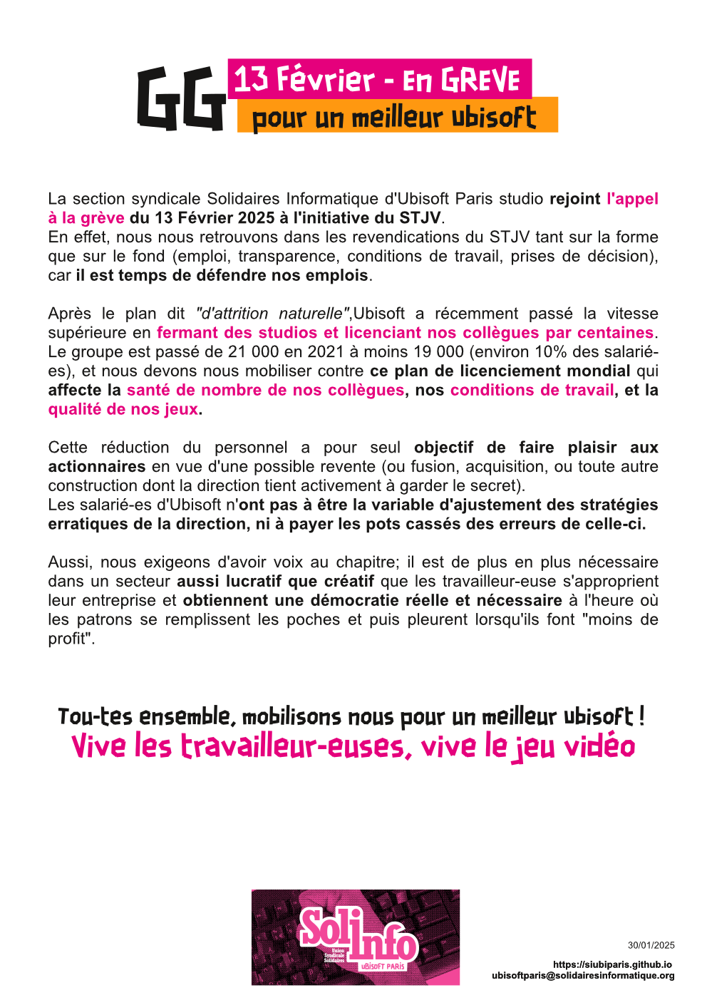

La section syndicale Solidaires Informatique d'Ubisoft Paris studio rejoint l'appel à la grève du 13 Février 2025 à l'initiative du STJV.

En effet, nous nous retrouvons dans les revendications du STJV tant sur la forme que sur le fond (emploi, transparence, conditions de travail, prises de décision), car il est temps de défendre nos emplois.

Après le plan dit "d'attrition naturelle",Ubisoft a récemment passé la vitesse supérieure en fermant des studios et licenciant nos collègues par centaines. Le groupe est passé de 21 000 en 2021 à moins 19 000 (environ 10% des salarié-es), et nous devons nous mobiliser contre ce plan de licenciement mondial qui affecte la santé de nombre de nos collègues, nos conditions de travail, et la qualité de nos jeux. 

Cette réduction du personnel a pour seul objectif de faire plaisir aux actionnaires en vue d'une possible revente (ou fusion, acquisition, ou toute autre construction dont la direction tient activement à garder le secret).

Les salarié-es d'Ubisoft n'ont pas à être la variable d'ajustement des stratégies erratiques de la direction, ni à payer les pots cassés des erreurs de celle-ci.

Aussi, nous exigeons d'avoir voix au chapitre; il est de plus en plus nécessaire dans un secteur aussi lucratif que créatif que les travailleur-euse s'approprient leur entreprise et obtiennent une démocratie réelle et nécessaire à l'heure où les patrons se remplissent les poches et puis pleurent lorsqu'ils font "moins de profit".

Tou-tes ensemble, mobilisons nous pour un meilleur Ubisoft ! 
Vive les travailleur-euses, vive le jeu vidéo
