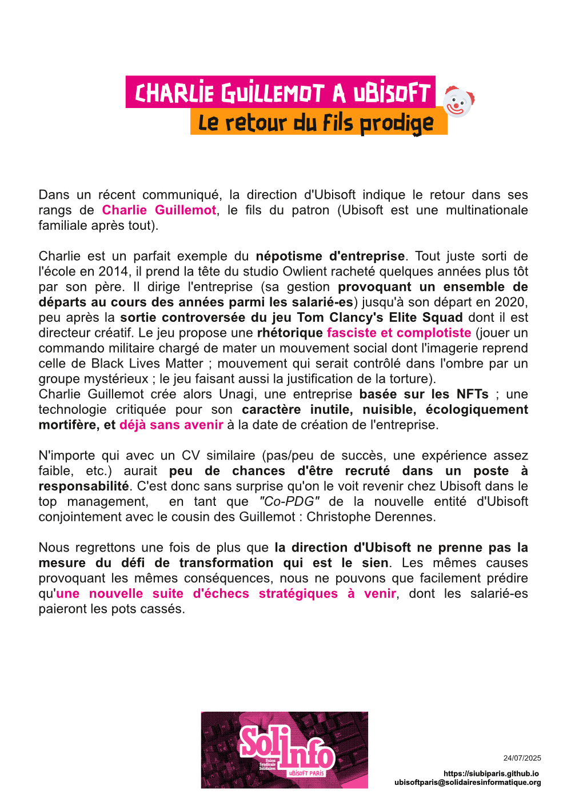

Dans un récent communiqué, la direction d'Ubisoft indique le retour dans ses rangs de Charlie Guillemot, le fils du patron (Ubisoft est une multinationale familiale après tout).

Charlie est un parfait exemple du népotisme d'entreprise. Tout juste sorti de l'école en 2014, il prend la tête du studio Owlient racheté quelques années plus tôt par son père. Il dirige l'entreprise (sa gestion provoquant un ensemble de départs au cours des années parmi les salarié-es) jusqu'à son départ en 2020, peu après la sortie controversée du jeu Tom Clancy's Elite Squad dont il est directeur créatif. Le jeu propose une rhétorique fasciste et complotiste (jouer un commando militaire chargé de mater un mouvement social dont l'imagerie reprend celle de Black Lives Matter ; mouvement qui serait contrôlé dans l'ombre par un groupe mystérieux ; le jeu faisant aussi la justification de la torture). 

Charlie Guillemot crée alors Unagi, une entreprise basée sur les NFTs ; une technologie critiquée pour son caractère inutile, nuisible, écologiquement mortifère, et déjà sans avenir à la date de création de l'entreprise.

N'importe qui avec un CV similaire (pas/peu de succès, une expérience assez faible, etc.) aurait peu de chances d'être recruté dans un poste à responsabilité. C'est donc sans surprise qu'on le voit revenir chez Ubisoft dans le top management,  en tant que "Co-PDG" de la nouvelle entité d'Ubisoft conjointement avec le cousin des Guillemot : Christophe Derennes.

Nous regrettons une fois de plus que la direction d'Ubisoft ne prenne pas la mesure du défi de transformation qui est le sien. Les mêmes causes provoquant les mêmes conséquences, nous ne pouvons que facilement prédire qu'une nouvelle suite d'échecs stratégiques à venir, dont les salarié-es paieront les pots cassés.
