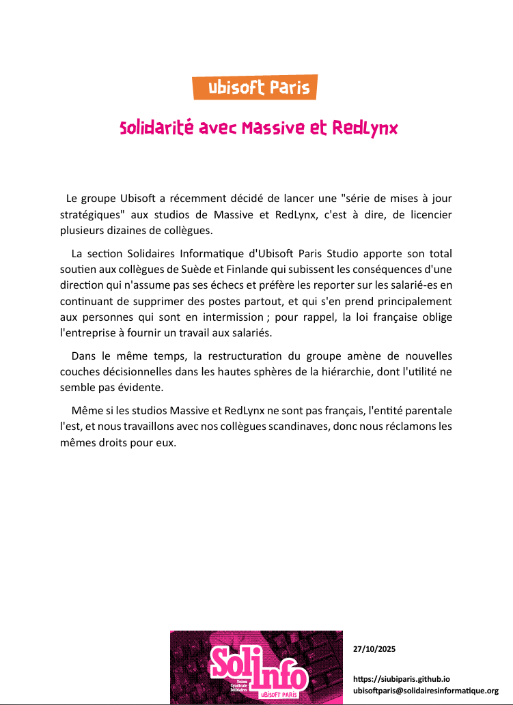

Le groupe Ubisoft a récemment décidé de lancer une "série de mises à jour stratégiques" aux studios de Massive et RedLynx, c'est à dire, de licencier plusieurs dizaines de collègues.

La section Solidaires Informatique d'Ubisoft Paris Studio apporte son total soutien aux collègues de Suède et Finlande qui subissent les conséquences d'une direction qui n'assume pas ses échecs et préfère les reporter sur les salarié-es en continuant de supprimer des postes partout, et qui s'en prend principalement aux personnes qui sont en intermission ; pour rappel, la loi française oblige l'entreprise à fournir un travail aux salariés.

Dans le même temps, la restructuration du groupe amène de nouvelles couches décisionnelles dans les hautes sphères de la hiérarchie, dont l'utilité ne semble pas évidente.

Même si les studios Massive et RedLynx ne sont pas français, l'entité parentale l'est, et nous travaillons avec nos collègues scandinaves, donc nous réclamons les mêmes droits pour eux.
