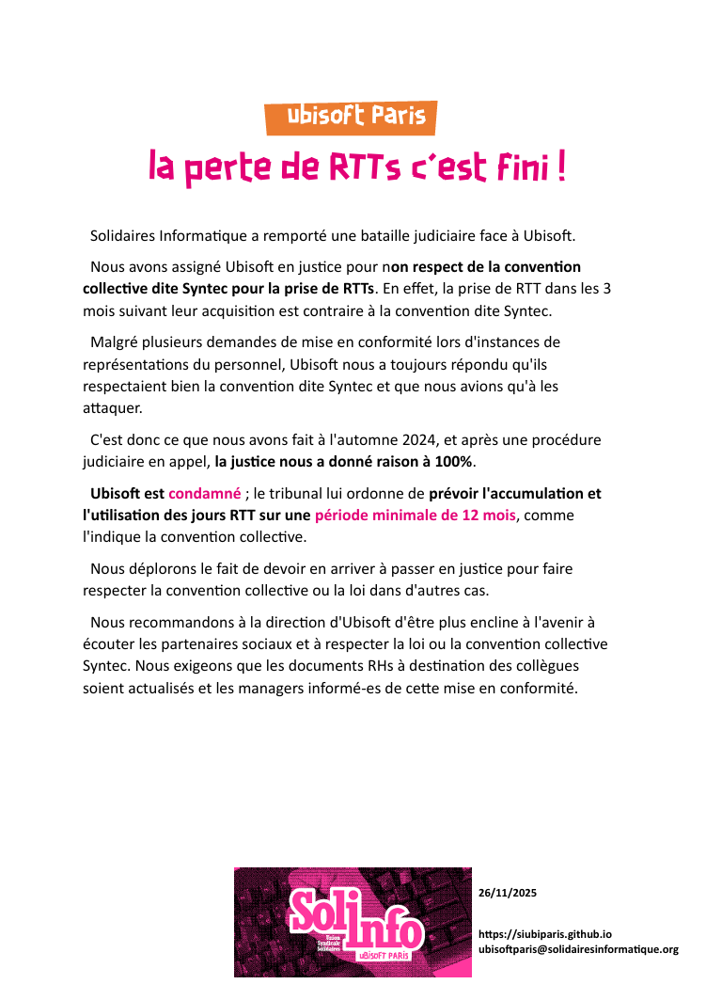

Solidaires Informatique a remporté une bataille judiciaire face à Ubisoft.

Nous avons assigné Ubisoft en justice pour non respect de la convention collective dite Syntec pour la prise de RTTs. En effet, la prise de RTT dans les 3 mois suivant leur acquisition est contraire à la convention dite Syntec.

Malgré plusieurs demandes de mise en conformité lors d'instances de représentations du personnel, Ubisoft nous a toujours répondu qu'ils respectaient bien la convention dite Syntec et que nous avions qu'à les 
attaquer.

C'est donc ce que nous avons fait à l'automne 2024, et après une procédure judiciaire en appel, la justice nous a donné raison à 100%. 

Ubisoft est condamné ; le tribunal lui ordonne de prévoir l'accumulation et l'utilisation des jours RTT sur une période minimale de 12 mois, comme 
l'indique la convention collective.

Nous déplorons le fait de devoir en arriver à passer en justice pour faire respecter la convention collective ou la loi dans d'autres cas.

Nous recommandons à la direction d'Ubisoft d'être plus encline à l'avenir à écouter les partenaires sociaux et à respecter la loi ou la convention collective Syntec. Nous exigeons que les documents RHs à destination des collègues soient actualisés et les managers informé-es de cette mise en conformité. 
