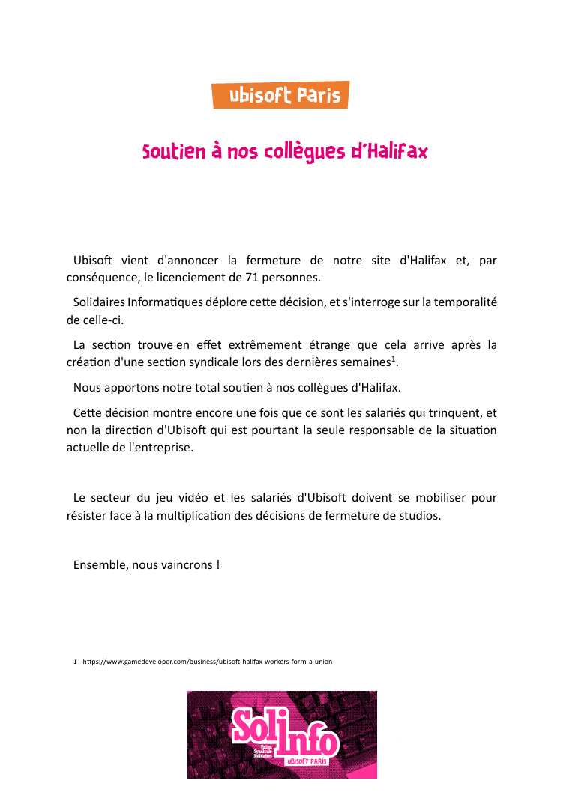

Ubisoft vient d'annoncer la fermeture de notre site d'Halifax et, par conséquence, le licenciement de 71 personnes.

Solidaires Informatiques déplore cette décision, et s'interroge sur la temporalité de celle-ci.  

La section trouve en effet extrêmement étrange que cela arrive après la création d'une section syndicale lors des dernières semaines.  

Nous apportons notre total soutien à nos collègues d'Halifax. 

Cette décision montre encore une fois que ce sont les salariés qui trinquent, et non la direction d'Ubisoft qui est pourtant la seule responsable de la situation actuelle de l'entreprise. 

Le secteur du jeu vidéo et les salariés d'Ubisoft doivent se mobiliser pour résister face à la multiplication des décisions de fermeture de studios. 

Ensemble, nous vaincrons !  
