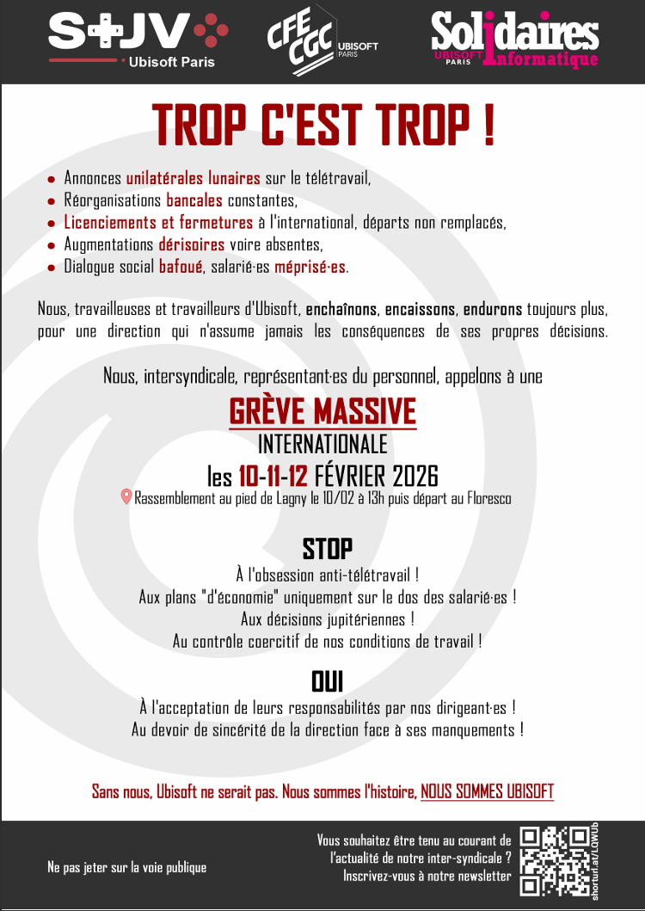

- Annonces unilatérales lunaires sur le télétravail
- Réorganisations bancales constantes
- Licenciements et fermetures à l'international, départs non remplacés
- Augmentations dérisoires voires absentes
- Dialogue social bafoué, salarié-es méprisé-es

Nous, travailleuses et travailleurs d'Ubisoft, enchaînons, encaissons, endurons toujours plus pour une direction qui n'assume jamais les conséquences de ses propres décisions.

Nous, intersyndicale, représentant-es du personnel, appelons à une 
GREVE MASSIVE et INTERNATIONALE
les 10-11-12 Février 2026

Rassemblement au pied de Lagny le 10/12 à 13h, puis départ au Floresco

STOP
à l'obsession anti-télétravail !
Aux plans "d'économie" uniquement sur le dos des salarié-es !
Aux décisions jupitériennes !
Au contrôle coercitif de nos conditions de travail !

OUI
à l'acceptation de leurs responsabilités par nos dirigeant-es !
Au devoir de sincérité de la direction face à ses manquements !

Sans nous, Ubisoft ne serait pas. Nous sommes l'histoire, NOUS SOMMES UBISOFT
