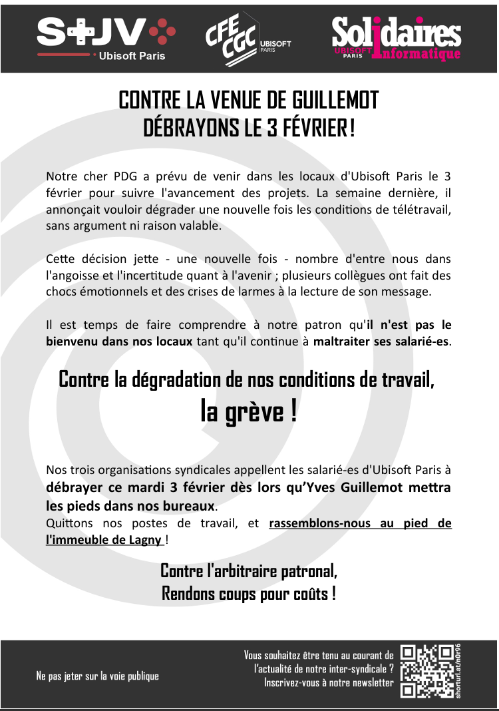

Notre cher PDG a prévu de venir dans les locaux d'Ubisoft Paris le 3 février pour suivre l'avancement des projets. La semaine dernière, il annonçait vouloir dégrader une nouvelle fois les conditions de télétravail, sans argument ni raison valable.

Cette décision jette - une nouvelle fois - nombre d'entre nous dans l'angoisse et l'incertitude quant à l'avenir ; plusieurs collègues ont fait des chocs émotionnels et des crises de larmes à la lecture de son message.

Il est temps de faire comprendre à notre patron qu'il n'est pas le bienvenu dans nos locaux tant qu'il continue à maltraiter ses salarié-es.

Contre la dégradation de nos conditions de travail, la grève !

Nos trois organisations syndicales appellent les salarié-es d'Ubisoft Paris à débrayer ce mardi 3 février dès lors qu’Yves Guillemot mettra les pieds dans nos bureaux. 
Quittons nos postes de travail, et rassemblons-nous au pied de l'immeuble de Lagny !

Contre l'arbitraire patronal,
Rendons coups pour coûts 
