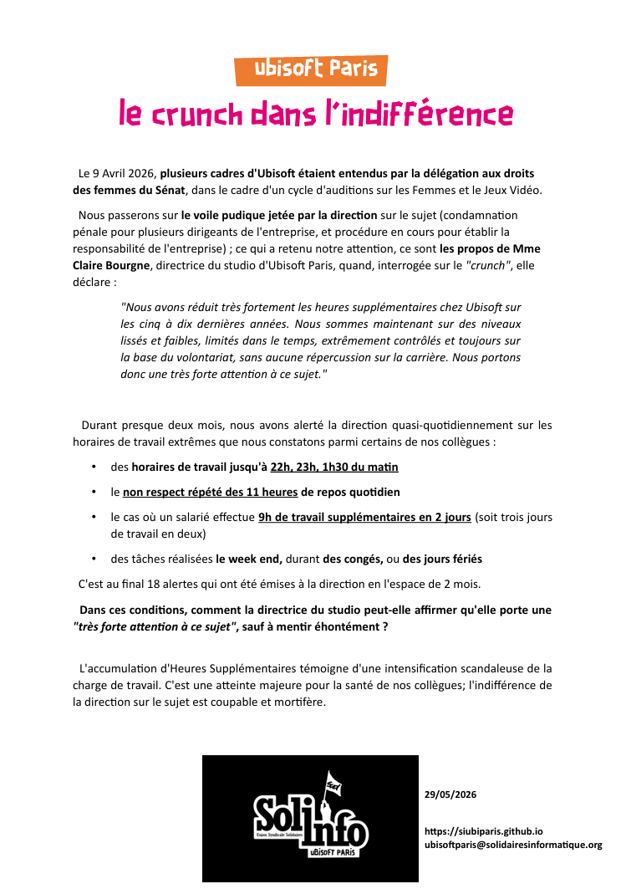

Le 9 Avril 2026, plusieurs cadres d'Ubisoft étaient entendus par la délégation aux droits des femmes du Sénat, dans le cadre d'un cycle d'auditions sur les Femmes et le Jeu Vidéo.

Nous passerons sur le voile pudique jetée par la direction sur le sujet (condamnation pénale pour plusieurs dirigeants de l'entreprise, et procédure en cours pour établir la responsabilité de l'entreprise) ; ce qui a retenu notre attention, ce sont les propos de Mme Claire Bourgne, directrice du studio d'Ubisoft Paris, quand, interrogée sur le "crunch", elle déclare :
"Nous avons réduit très fortement les heures supplémentaires chez Ubisoft sur les cinq à dix dernières années. Nous sommes maintenant sur des niveaux lissés et faibles, limités dans le temps, extrêmement contrôlés et toujours sur la base du volontariat, sans aucune répercussion sur la carrière. Nous portons donc une très forte attention à ce sujet."

Durant presque deux mois, nous avons alerté la direction quasi-quotidiennement sur les horaires de travail extrêmes que nous constatons parmi certains de nos collègues :
* des horaires de travail jusqu'à 22h, 23h, 1h30 du matin
* le non respect répété des 11 heures de repos quotidien
* le cas où un salarié effectue 9h de travail supplémentaires en 2 jours (soit trois jours de travail en deux)
* des tâches réalisées le week end, durant des congés, ou des jours fériés

C'est au final 18 alertes qui ont été émises à la direction en l'espace de 2 mois.

Dans ces conditions, comment la directrice du studio peut-elle affirmer qu'elle porte une "très forte attention à ce sujet", sauf à mentir éhontément ?

L'accumulation d'Heures Supplémentaires témoigne d'une intensification scandaleuse de la charge de travail. C'est une atteinte majeure pour la santé de nos collègues; l'indifférence de la direction sur le sujet est coupable et mortifère.
