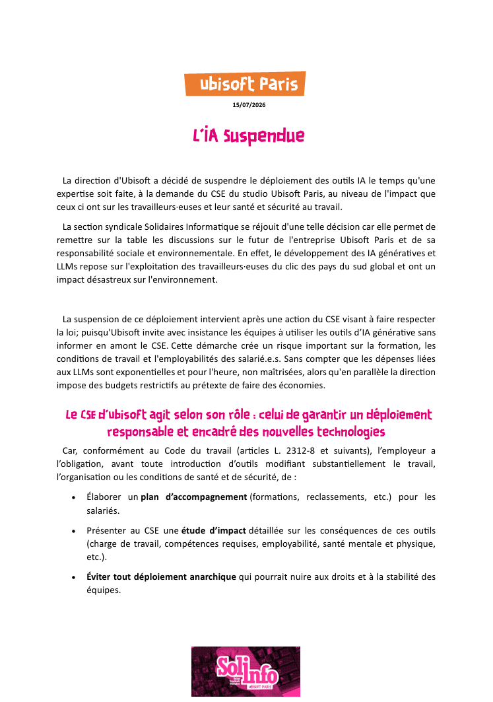
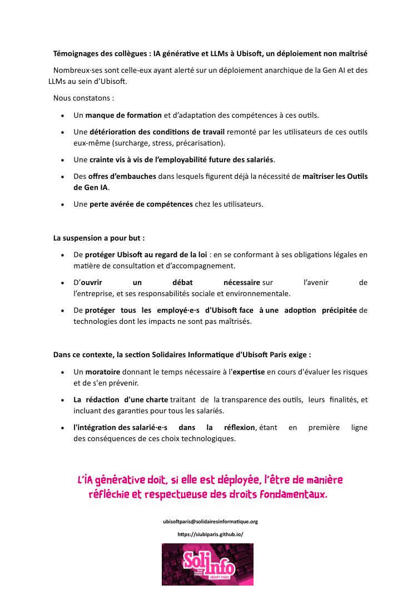

La direction d'Ubisoft a décidé de suspendre le déploiement des outils IA le temps qu'une expertise soit faite, à la demande du CSE du studio Ubisoft Paris, au niveau de l'impact que ceux ci ont sur les travailleurs·euses et leur santé et sécurité au travail. 

La section syndicale Solidaires Informatique se réjouit d'une telle décision car elle permet de remettre sur la table les discussions sur le futur de l'entreprise Ubisoft Paris et de sa responsabilité sociale et environnementale. En effet, le développement des IA génératives et LLMs repose sur l'exploitation des travailleurs·euses du clic des pays du sud global et ont un impact désastreux sur l'environnement. 

La suspension de ce déploiement intervient après une action du CSE visant à faire respecter la loi; puisqu'Ubisoft invite avec insistance les équipes à utiliser les outils d’IA générative sans informer en amont le CSE. Cette démarche crée un risque important sur la formation, les conditions de travail et l'employabilités des salarié.e.s. Sans compter que les dépenses liées aux LLMs sont exponentielles et pour l'heure, non maîtrisées, alors qu'en parallèle la direction impose des budgets restrictifs au prétexte de faire des économies. 

# Le CSE d'Ubisoft agit selon son rôle : celui de garantir un déploiement responsable et encadré des nouvelles technologies 

Car, conformément au Code du travail (articles L. 2312-8 et suivants), l’employeur a l’obligation, avant toute introduction d’outils modifiant substantiellement le travail, l’organisation ou les conditions de santé et de sécurité, de : 
• Élaborer un plan d’accompagnement (formations, reclassements, etc.) pour les salariés. 
• Présenter au CSE une étude d’impact détaillée sur les conséquences de ces outils (charge de travail, compétences requises, employabilité, santé mentale et physique, etc.). 
• Éviter tout déploiement anarchique qui pourrait nuire aux droits et à la stabilité des équipes.

### Témoignages des collègues : IA générative et LLMs à Ubisoft, un déploiement non maîtrisé 

Nombreux·ses sont celle-eux ayant alerté sur un déploiement anarchique de la Gen AI et des LLMs au sein d’Ubisoft. 
Nous constatons : 
* Un manque de formation et d’adaptation des compétences à ces outils. 
* Une détérioration des conditions de travail remonté par les utilisateurs de ces outils eux-même (surcharge, stress, précarisation). 
* Une crainte vis à vis de l’employabilité future des salariés. 
* Des offres d’embauches dans lesquels figurent déjà la nécessité de maîtriser les Outils de Gen IA. 
* Une perte avérée de compétences chez les utilisateurs. 

La suspension a pour but : 
* De protéger Ubisoft au regard de la loi : en se conformant à ses obligations légales en matière de consultation et d’accompagnement. 
* D’ouvrir un débat nécessaire sur l’avenir de l’entreprise, et ses responsabilités sociale et environnementale. 
* De protéger tous les employé·e·s d'Ubisoft face à une adoption précipitée de technologies dont les impacts ne sont pas maîtrisés. 

Dans ce contexte, la section Solidaires Informatique d'Ubisoft Paris exige : 
* Un moratoire donnant le temps nécessaire à l'expertise en cours d'évaluer les risques et de s'en prévenir. 
* La rédaction d'une charte traitant de la transparence des outils, leurs finalités, et incluant des garanties pour tous les salariés. 
* l'intégration des salarié·e·s dans la réflexion, étant en première ligne des conséquences de ces choix technologiques. 

### L’IA générative doit, si elle est déployée, l’être de manière réfléchie et respectueuse des droits fondamentaux.
