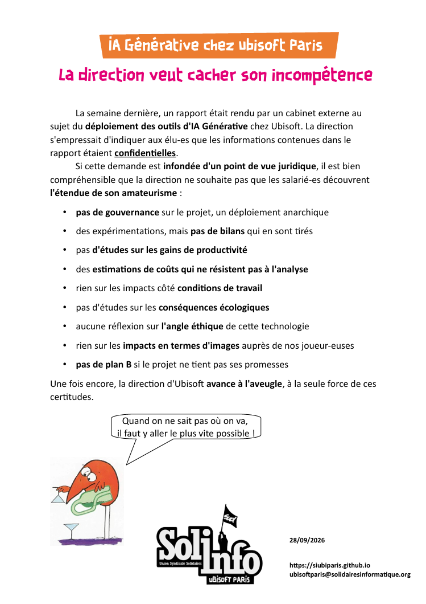

La semaine dernière, un rapport était rendu par un cabinet externe au sujet du _déploiement des outils d'IA Générative_ chez Ubisoft. La direction s'empressait d'indiquer aux élu-es que les informations contenues dans le rapport étaient _confidentielles_.

Si cette demande est _infondée d'un point de vue juridique_, il est bien compréhensible que la direction ne souhaite pas que les salarié-es découvrent _l'étendue de son amateurisme_ :
  
* _pas de gouvernance_ sur le projet, un déploiement anarchique
* des expérimentations, mais _pas de bilan_ qui en sont tirés
* pas _d'études sur les gains de productivité_
* des _estimations de coûts qui ne résistent pas à l'analyse_
* rien sur les impacts côté _conditions de travail_
* pas d'études sur les _conséquences écologiques_
* aucune réflexion sur _l'angle éthique_ de cette technologie
* rien sur les _impacts en termes d'images_ auprès de nos joueur-euses
* _pas de plan B_ si le projet ne tient pas ses promesses

Une fois encore, la direction d'Ubisoft _avance à l'aveugle_, à la seule force de ces certitudes.

"Quand on ne sait pas où on va, il faut y aller le plus vite possible !"

