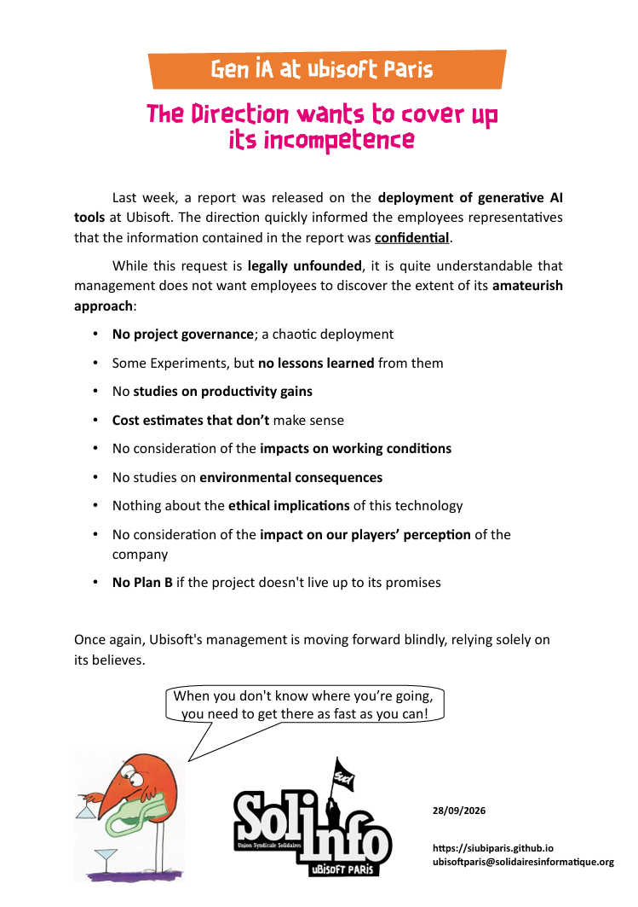

** ENGLISH BELOW **

La semaine dernière, un rapport était rendu par un cabinet externe au sujet du _déploiement des outils d'IA Générative_ chez Ubisoft. La direction s'empressait d'indiquer aux élu-es que les informations contenues dans le rapport étaient _confidentielles_.

Si cette demande est _infondée d'un point de vue juridique_, il est bien compréhensible que la direction ne souhaite pas que les salarié-es découvrent _l'étendue de son amateurisme_ :
  
* _pas de gouvernance_ sur le projet, un déploiement anarchique
* des expérimentations, mais _pas de bilan_ qui en sont tirés
* pas _d'études sur les gains de productivité_
* des _estimations de coûts qui ne résistent pas à l'analyse_
* rien sur les impacts côté _conditions de travail_
* pas d'études sur les _conséquences écologiques_
* aucune réflexion sur _l'angle éthique_ de cette technologie
* rien sur les _impacts en termes d'images_ auprès de nos joueur-euses
* _pas de plan B_ si le projet ne tient pas ses promesses

Une fois encore, la direction d'Ubisoft _avance à l'aveugle_, à la seule force de ces certitudes.

"Quand on ne sait pas où on va, il faut y aller le plus vite possible !"

---------------

Last week, a report was released on the _deployment of generative AI tools_ at Ubisoft. The direction quickly informed the employees representatives that the information contained in the report was _confidential_.

While this request is _legally unfounded_, it is quite understandable that management does not want employees to discover the extent of its _amateurish approach_:

* _No project governance_; a chaotic deployment
* Some Experiments, but _no lessons learned_ from them
* No _studies on productivity gains_
* _Cost estimates that don’t make sense_
* No consideration of the _impacts on working conditions_
* No studies on _environmental consequences_
* Nothing about the _ethical implications_ of this technology
* No consideration of the _impact on our players’ perception_ of the company
* _No Plan B_ if the project doesn't live up to its promises
      
Once again, Ubisoft's management is moving forward blindly, relying solely on its believes.

"When you don't know where you’re going, you need to get there as fast as you can!"

