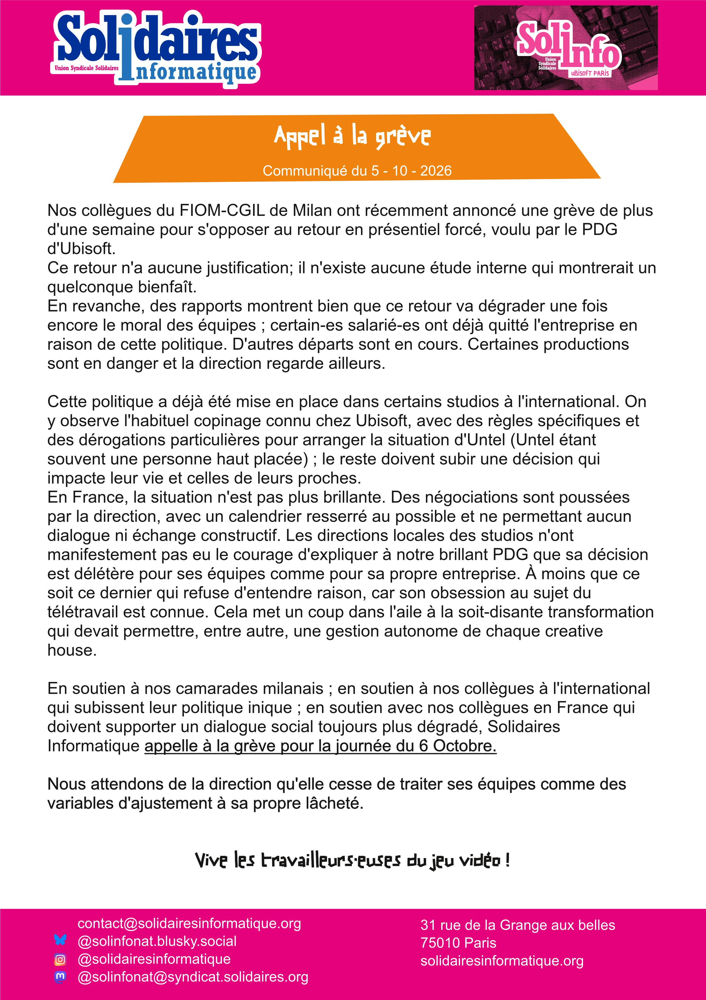

Nos collègues du FIOM-CGIL de Milan ont récemment annoncé une grève de plus d'une semaine pour s'opposer au retour en présentiel forcé, voulu par le PDG d'Ubisoft.

Ce retour n'a aucune justification; il n'existe aucune étude interne qui montrerait un quelconque bienfaît.

En revanche, des rapports montrent bien que ce retour va dégrader une fois encore le moral des équipes ; certain-ess salarié-es ont déjà quitté l'entreprise en raison de cette politique. D'autres départs sont en cours. Certaines productions sont en danger et la direction regarde ailleurs.

Cette politique a déjà été mise en place dans certains studios à l'international. On y observe l'habituel copinage connu chez Ubisoft, avec des règles spécifiques et des dérogations particulières pour arranger la situation d'Untel (Untel étant souvent une personne haut placée) ; le reste doivent subir une décision qui impacte leur vie et celles de leurs proches.
En France, la situation n'est pas plus brillante. Des négociations sont poussées par la direction, avec un calendrier resserré au possible et ne permettant aucun dialogue ni échange constructif. Les directions locales des studios n'ont manifestement pas eu le courage d'expliquer à notre brillant PDG que sa décision est délétère pour ses équipes comme pour sa propre entreprise. À moins que ce soit ce dernier qui refuse d'entendre raison, car son obsession au sujet du télétravail est connue. Cela met un coup dans l'aile à la soit-disante transformation qui devait permettre, entre autre, une gestion autonome de chaque creative house. 

En soutien à nos camarades milanais ; en soutien à nos collègues à l'international qui subissent leur politique inique ; en soutien avec nos collègues en France qui doivent supporter un dialogue social toujours plus dégradé, Solidaires Informatique appelle à la grève pour la journée du 6 Octobre.

Nous attendons de la direction qu'elle cesse de traiter ses équipes comme des variables d'ajustement à sa propre lâcheté.

